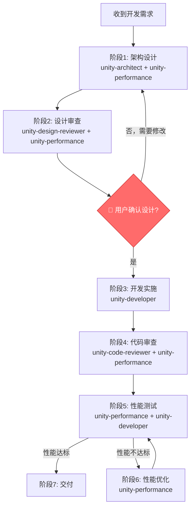

# Unity开发代理系统

这是一个完整的Unity项目开发代理系统，包含5个专业代理和1个工作流程技能，确保高质量的功能开发。

## 📁 目录结构

```
.claude/
├── agents/                          # 专业代理定义
│   ├── unity-architect.md           # 架构设计代理
│   ├── unity-design-reviewer.md     # 设计审查代理
│   ├── unity-developer.md           # 开发实施代理
│   ├── unity-performance.md         # 性能优化代理
│   └── unity-code-reviewer.md       # 代码审查代理
│
├── skills/                          # 技能定义
│   └── agent-workflow/              # 工作流程技能
│       ├── SKILL.md                 # 技能主文件
│       └── references/              # 详细参考文档
│           ├── phase1-design.md     # 阶段1：架构设计
│           ├── phase2-review.md     # 阶段2：设计审查
│           ├── phase3-development.md # 阶段3：开发实施
│           ├── phase4-code-review.md # 阶段4：代码审查
│           ├── phase5-testing.md    # 阶段5：测试验证
│           └── phase6-delivery.md   # 阶段6：交付
│
└── README.md                        # 本文件
```

## 🤖 专业代理

### 1. Unity架构设计代理 (unity-architect)
**文件**: `.claude/agents/unity-architect.md`

**职责**：
- 架构设计和技术选型
- 模块划分和接口设计
- 使用Mermaid图表可视化架构
- 设计模式应用

**核心能力**：
- 系统架构设计（MVC/MVP/MVVM/ECS）
- 23种设计模式灵活运用
- 解耦与松耦合设计
- 代码组织和模块化

**输出**：
- 架构设计文档
- 架构图表（Mermaid）
- 模块说明
- 技术选型理由
- 实施计划

---

### 2. Unity设计审查代理 (unity-design-reviewer)
**文件**: `.claude/agents/unity-design-reviewer.md`

**职责**：
- 审查架构设计方案
- 提出质疑和改进建议
- 识别潜在风险
- 确保设计可靠性

**审查维度**：
- ✅ 架构完整性（需求覆盖、模块划分、依赖关系）
- ✅ 设计质量（设计模式、接口设计、数据流）
- ✅ 可实施性（技术可行性、实施复杂度、迁移策略）
- ✅ 性能与扩展性（性能考虑、可扩展性、可维护性）
- ✅ 风险与问题（技术债务、边界情况、Unity特定问题）

**输出**：
- 设计审查报告
- 问题清单（高/中/低优先级）
- 质询问题
- 改进建议
- 审查结论

---

### 3. Unity开发代理 (unity-developer)
**文件**: `.claude/agents/unity-developer.md`

**职责**：
- 根据设计文档编写代码
- 遵循项目规范和最佳实践
- 使用Unity MCP编译检查
- 集成到现有系统

**技术栈**：
- C# 9.0+
- Unity 2021.3 LTS
- Zenject（依赖注入）
- UniRx（响应式编程）
- UniTask（异步编程）
- DOTween（动画）

**开发规范**：
- 命名规范（PascalCase/camelCase）
- 中文注释
- 架构分层（Model-View-Presenter）
- 依赖注入
- 性能优化

**输出**：
- 高质量代码实现
- 完整的注释
- 依赖注入配置
- 初步测试

---

### 4. Unity性能优化代理 (unity-performance)
**文件**: `.claude/agents/unity-performance.md`

**职责**：
- 性能分析和优化
- 内存管理
- 渲染优化
- 平台特定优化

**优化领域**：
- **CPU优化**：减少GC、对象池、缓存优化
- **GPU优化**：Draw Call优化、批处理、Shader优化
- **内存优化**：纹理压缩、资源管理、内存泄漏检测
- **渲染优化**：LOD、遮挡剔除、光照优化

**工具使用**：
- Unity Profiler
- Frame Debugger
- Memory Profiler
- Physics Debugger

**输出**：
- 性能分析报告
- 优化方案
- 优化前后对比
- 后续建议

---

### 5. Unity代码审查代理 (unity-code-reviewer)
**文件**: `.claude/agents/unity-code-reviewer.md`

**职责**：
- 代码质量审查
- 规范性检查
- 安全性审查
- Unity特定问题检查

**审查清单**：
- ✅ 代码质量（职责单一、方法长度、代码重复、复杂度）
- ✅ 命名规范（类名、方法名、字段名、变量名）
- ✅ 注释规范（XML注释、中文注释、清晰度）
- ✅ Unity特定（MonoBehaviour、协程、事件、资源）
- ✅ 安全性（空引用、异常处理、资源释放）
- ✅ 性能影响（缓存、GC、Update优化）

**输出**：
- 代码审查报告
- 问题清单（高/中/低优先级）
- 代码示例（问题代码 vs 改进代码）
- 改进建议

---

## 🔄 标准工作流程

### agent-workflow技能
**文件**: `.claude/skills/agent-workflow/SKILL.md`

这是Unity功能开发的标准工作流程，确保每个功能都经过完整的设计、审查、开发、测试流程。

### 工作流程图



### 🔴 关键规则

**用户确认点**：设计阶段完成后，**必须等待用户明确确认**后才能进入开发阶段。

禁止在没有用户确认的情况下自动开始开发。

### 七个阶段详解

#### 阶段1：架构设计⚡
**负责**: unity-architect + unity-performance
**参考**: `.claude/skills/agent-workflow/references/phase1-design.md`

- 需求分析
- 现状调研
- 架构设计（模块、技术、接口、数据流）
- **性能设计**（性能目标、关键路径、优化策略）
- 架构可视化（Mermaid图表）
- 输出设计文档

#### 阶段2：设计审查⚡
**负责**: unity-design-reviewer + unity-performance
**参考**: `.claude/skills/agent-workflow/references/phase2-review.md`

- 理解设计
- 系统化审查（完整性、质量、可实施性、**性能**、风险）
- **性能设计审查**（目标、策略、风险）
- 提出质询
- 输出审查报告
- 与架构师讨论

#### 🔴 用户确认点
- 展示完整设计方案（包括性能设计）
- 列出审查发现
- 明确询问："设计方案已完成，是否确认开始开发？"
- 等待用户回复

#### 阶段3：开发实施
**负责**: unity-developer
**参考**: `.claude/skills/agent-workflow/references/phase3-development.md`

- 环境检查
- 按模块实施
- 遵循编码规范（包括性能最佳实践）
- 持续验证（Unity MCP）
- 依赖注入配置
- 集成到现有系统

#### 阶段4：代码审查⚡
**负责**: unity-code-reviewer + unity-performance
**参考**: `.claude/skills/agent-workflow/references/phase4-code-review.md`

- 架构一致性审查
- 代码质量审查
- 命名和注释规范审查
- Unity特定审查
- 安全性审查
- **性能影响审查**（GC、缓存、Update等）
- 输出审查报告

#### 阶段5：性能测试⚡
**负责**: unity-performance + unity-developer
**参考**: `.claude/skills/agent-workflow/references/phase5-testing.md`

- **性能基准测试**（帧率、内存、CPU/GPU）
- **Profiler深度分析**
- **压力测试**
- 功能测试（基本、边界、异常）
- 集成测试
- 输出测试报告

#### 阶段6：性能优化⚡（条件触发）
**负责**: unity-performance
**参考**: `.claude/skills/agent-workflow/references/phase6-optimization.md`
**触发条件**: 仅当阶段5性能测试**未达标**时

- 性能问题分析
- 制定优化方案
- 实施优化（CPU/GPU/内存）
- 验证优化效果
- 迭代直到达标

#### 阶段7：交付
**参考**: `.claude/skills/agent-workflow/references/phase7-delivery.md`

- 代码整理
- 版本控制
- 编写交付文档
- **性能报告**（包含测试和优化结果）
- 功能演示
- 交付确认

---

## 🚀 使用示例

### 示例1：添加多语言支持

**用户请求**：
```
我想为Solitaire项目添加多语言支持系统
```

**工作流程**：

1. **阶段1 - 架构设计** (unity-architect)
   - 分析需求：支持中英文切换
   - 设计模块：LocalizationService、LanguageData、UI更新机制
   - 技术选型：ScriptableObject存储、观察者模式通知
   - 输出架构图和设计文档

2. **阶段2 - 设计审查** (unity-design-reviewer)
   - 审查设计完整性
   - 质询：如何处理动态文本？字体切换？
   - 输出审查报告

3. **🔴 用户确认**
   - 展示设计方案和审查结果
   - 询问："设计方案已完成，是否确认开始开发？"
   - 等待用户确认

4. **阶段3 - 开发实施** (unity-developer)
   - 实现ILocalizationService接口
   - 创建LocalizationManager
   - 集成到UI系统
   - 使用Unity MCP编译检查

5. **阶段4 - 代码审查** (unity-code-reviewer)
   - 审查代码质量和规范
   - 检查资源管理
   - 输出审查报告

6. **阶段5 - 测试验证**
   - 测试语言切换功能
   - 测试UI更新
   - 性能测试
   - 输出测试报告

7. **阶段6 - 交付**
   - 提供完整文档
   - 演示功能
   - 交付代码

---

## 📋 快速参考

### 何时触发工作流程？

当用户请求以下任务时，自动激活agent-workflow：
- ✅ 开发新功能
- ✅ 添加新系统
- ✅ 重构现有模块
- ✅ 实现复杂功能

### 简单任务如何处理？

对于简单任务（如调整参数、修改配置），可以简化流程：
- 快速设计（口头说明）
- 直接实施
- 简单验证

### 紧急Bug如何处理？

紧急Bug修复流程：
- 快速分析问题
- 设计修复方案
- 实施修复
- 回归测试

---

## 🎯 质量保证

### 多重审查机制
1. **设计阶段**：unity-design-reviewer审查架构设计
2. **用户确认**：用户审查并确认设计方案
3. **代码阶段**：unity-code-reviewer审查代码质量
4. **测试阶段**：unity-performance检查性能

### 标准检查清单
每个阶段都有详细的检查清单，确保不遗漏任何问题。

### 文档化流程
从设计到交付，每个阶段都有完整的文档记录。

---

## 📚 相关文档

### 代理文档
- [Unity架构设计代理](.claude/agents/unity-architect.md)
- [Unity设计审查代理](.claude/agents/unity-design-reviewer.md)
- [Unity开发代理](.claude/agents/unity-developer.md)
- [Unity性能优化代理](.claude/agents/unity-performance.md)
- [Unity代码审查代理](.claude/agents/unity-code-reviewer.md)

### 工作流程文档
- [工作流程主文件](.claude/skills/agent-workflow/SKILL.md)
- [阶段1：架构设计⚡](.claude/skills/agent-workflow/references/phase1-design.md)
- [阶段2：设计审查⚡](.claude/skills/agent-workflow/references/phase2-review.md)
- [阶段3：开发实施](.claude/skills/agent-workflow/references/phase3-development.md)
- [阶段4：代码审查⚡](.claude/skills/agent-workflow/references/phase4-code-review.md)
- [阶段5：性能测试⚡](.claude/skills/agent-workflow/references/phase5-testing.md)
- [阶段6：性能优化⚡](.claude/skills/agent-workflow/references/phase6-optimization.md)
- [阶段7：交付](.claude/skills/agent-workflow/references/phase7-delivery.md)

---

## 🔧 技术栈

### Unity环境
- Unity 2021.3.45f2
- .NET 4.x
- C# 9.0+

### 核心框架
- **Zenject** - 依赖注入
- **UniRx** - 响应式编程
- **UniTask** - 异步编程
- **DOTween** - 动画

### 工具
- Unity MCP - Unity集成
- Unity Profiler - 性能分析
- Memory Profiler - 内存分析

---

## ✨ 特色功能

### 1. 中文优先
所有代理都使用中文进行交互和注释，符合项目要求。

### 2. 可视化架构
使用Mermaid图表展示架构设计，清晰直观。

### 3. 系统化流程
六个阶段环环相扣，确保高质量交付。

### 4. 用户控制
设计阶段完成后必须等待用户确认，用户完全掌控开发节奏。

### 5. Unity MCP集成
开发阶段实时使用Unity MCP进行编译检查，快速发现问题。

---

## 📞 支持

如有问题或建议，请参考具体的代理文档或工作流程文档。

---

**版本**: 1.0
**创建日期**: 2024-03-12
**最后更新**: 2024-03-12
