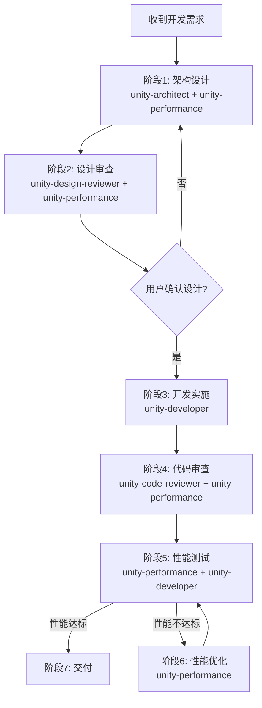

# Unity Agent工作流程

Unity功能开发的标准工作流程，确保高质量的架构设计和代码实现。

## 何时使用此技能

当用户请求以下任务时，自动激活此工作流程：
- 开发新功能（如：添加多语言支持、实现存档系统）
- 添加新系统（如：成就系统、社交系统）
- 重构现有模块（如：重构GameManager、优化UI架构）
- 实现复杂功能（如：AI系统、战斗系统）

## 工作流程总览



## 核心原则

**🔴 关键规则：设计阶段完成后，必须等待用户明确确认后才能进入开发阶段**

## 标准流程

### 阶段1：架构设计
**负责代理**：`unity-architect` + `unity-performance`

**任务**：
1. 分析需求，理解问题
2. 设计架构方案（使用Mermaid图表）
3. 定义模块、接口、数据流
4. **性能设计**：从架构层面考虑性能影响
5. 输出设计文档（包含性能考虑）

**性能设计要点**（unity-performance参与）：
- 识别性能关键路径
- 评估潜在性能瓶颈
- 设计性能优化策略（对象池、缓存等）
- 设定性能目标（帧率、内存等）

**检查清单**：参见 `references/phase1-design.md`

---

### 阶段2：设计审查
**负责代理**：`unity-design-reviewer` + `unity-performance`

**任务**：
1. 审查架构设计的完整性和合理性
2. 提出质疑和改进建议
3. 识别潜在风险
4. **性能审查**：审查性能设计是否合理
5. 与架构师讨论优化方案

**性能审查要点**（unity-performance参与）：
- 是否识别了性能关键点？
- 性能目标是否合理？
- 是否有性能优化策略？
- 是否存在明显的性能问题？

**检查清单**：参见 `references/phase2-review.md`

---

### 🔴 用户确认点

**必须执行**：
1. 展示完整的设计方案（包括架构图、模块说明、技术选型）
2. 列出设计审查的关键发现
3. **明确询问用户**："设计方案已完成，是否确认开始开发？"
4. **等待用户明确回复**：
   - 如果用户说"确认"、"可以"、"开始开发"等 → 进入阶段3
   - 如果用户提出修改意见 → 返回阶段1调整设计
   - 如果用户需要时间考虑 → 等待

**禁止**：在没有用户明确确认的情况下自动进入开发阶段

---

### 阶段3：开发实施
**负责代理**：`unity-developer`

**任务**：
1. 根据设计文档编写代码
2. 遵循项目规范和最佳实践
3. 使用Unity MCP编译检查
4. 添加必要的中文注释

**检查清单**：参见 `references/phase3-development.md`

---

### 阶段4：代码审查
**负责代理**：`unity-code-reviewer` + `unity-performance`

**任务**：
1. 审查代码质量和规范性
2. 检查安全性
3. **性能影响审查**：检查代码的性能影响
4. 验证是否符合架构设计
5. 提供改进建议

**性能审查要点**（unity-performance参与）：
- 是否有频繁的GC分配？
- 是否缓存了组件引用？
- Update中是否有昂贵操作？
- 是否使用了对象池？
- 是否有性能问题代码模式？

**检查清单**：参见 `references/phase4-code-review.md`

---

### 阶段5：性能测试
**负责代理**：`unity-performance` + `unity-developer`

**任务**：
1. **性能基准测试**：测试帧率、内存、CPU/GPU使用
2. **Profiler分析**：使用Unity Profiler进行详细分析
3. **压力测试**：极限情况下的性能表现
4. 功能测试：验证功能是否正常工作
5. 集成测试：验证与现有系统的集成

**性能测试要点**（unity-performance主导）：
- 帧率是否达标？（目标：60FPS）
- 内存使用是否合理？
- 是否有内存泄漏？
- GC分配是否过多？
- Draw Call是否合理？
- 是否存在性能瓶颈？

**检查清单**：参见 `references/phase5-testing.md`

---

### 阶段6：性能优化（条件触发）
**负责代理**：`unity-performance`

**触发条件**：
如果阶段5的性能测试**未达标**，则进入此阶段进行性能优化。

**任务**：
1. 分析性能瓶颈
2. 制定优化方案
3. 实施性能优化
4. 验证优化效果
5. 重复直到性能达标

**优化方向**：
- CPU优化（减少GC、对象池、缓存）
- GPU优化（Draw Call、批处理、Shader）
- 内存优化（纹理压缩、资源管理）
- 算法优化（数据结构、复杂度）

**完成条件**：
- 性能指标达到设计目标
- 无明显性能问题
- 用户体验流畅

---

### 阶段7：交付
**任务**：
1. 总结实现内容
2. 列出新增/修改的文件
3. 说明使用方法
4. **性能报告**：提供性能测试和优化报告
5. 记录已知问题（如有）
6. 提供后续优化建议（如有）

**检查清单**：参见 `references/phase6-delivery.md`

## 快速参考

### 阶段切换命令
```
当前阶段：[阶段名称]
下一步：[具体行动]
检查清单：[完成情况]
```

### 工作流程状态追踪
使用TodoWrite工具追踪每个阶段的进度。

## 特殊情况处理

### 简单任务
如果是非常简单的任务（如修改配置、调整参数），可以简化流程：
1. 快速设计（口头说明方案）
2. 直接实施
3. 简单验证

### 紧急修复
如果是紧急Bug修复：
1. 快速分析问题
2. 设计修复方案
3. 实施修复
4. 回归测试

## 性能优先原则

**贯穿整个流程的性能关注**：
- 🎯 阶段1：架构设计时考虑性能
- 🔍 阶段2：设计审查时审查性能
- 💻 阶段3：开发时遵循性能最佳实践
- 📋 阶段4：代码审查时检查性能影响
- ⚡ 阶段5：深度性能测试
- 🚀 阶段6：性能优化（如需要）
- ✅ 阶段7：提供性能报告

**性能目标**：
- 帧率：≥60 FPS（移动端可放宽至30 FPS）
- 内存：合理的内存占用，无内存泄漏
- GC分配：<1KB/frame
- Draw Call：移动端<100，PC<500

## 相关资源

详细的每个阶段的检查清单和指南，请参考：
- `references/phase1-design.md` - 架构设计阶段（包含性能设计）
- `references/phase2-review.md` - 设计审查阶段（包含性能审查）
- `references/phase3-development.md` - 开发实施阶段
- `references/phase4-code-review.md` - 代码审查阶段（包含性能审查）
- `references/phase5-testing.md` - 性能测试阶段（性能主导）
- `references/phase6-optimization.md` - 性能优化阶段（条件触发）
- `references/phase7-delivery.md` - 交付阶段
