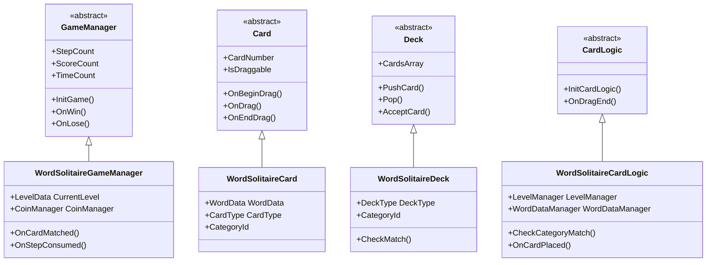
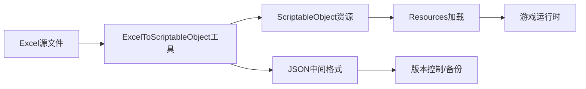
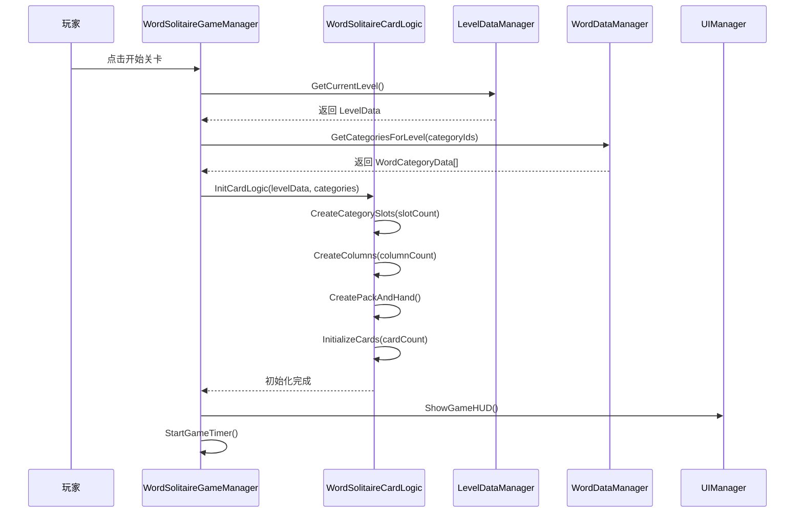
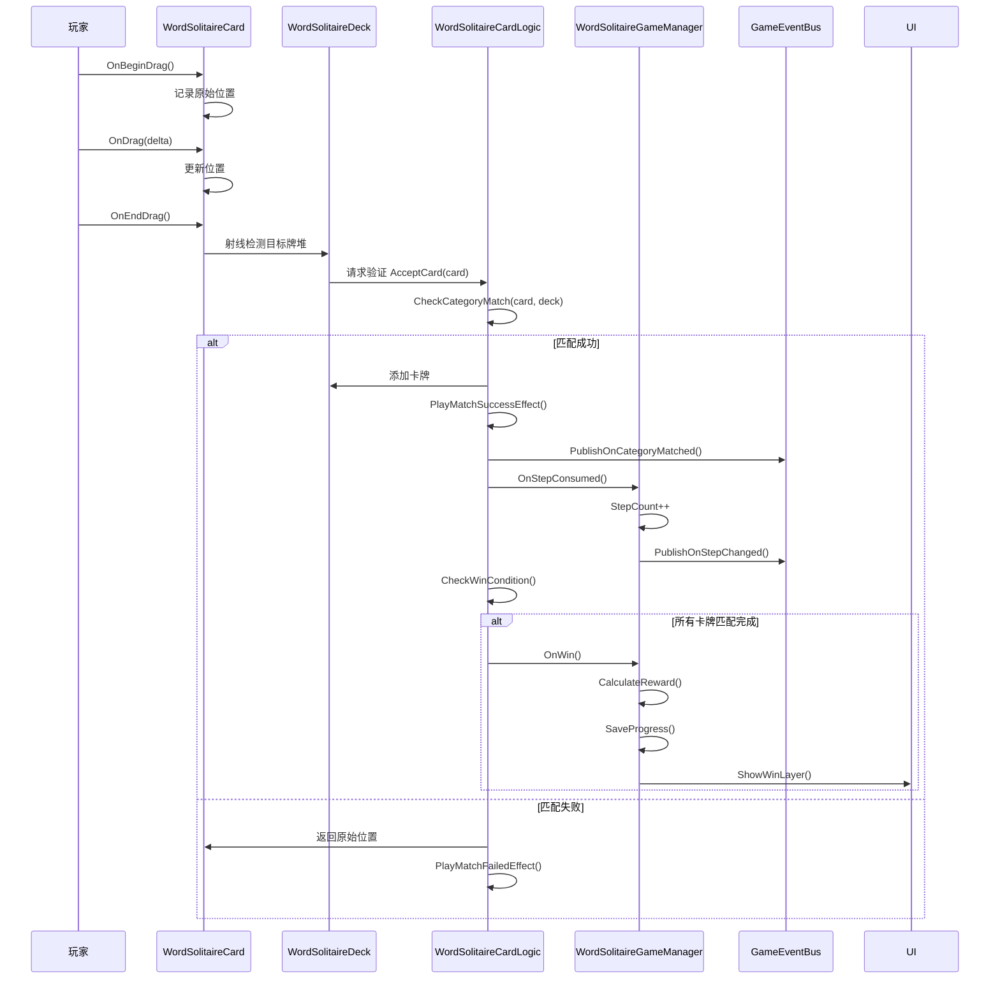
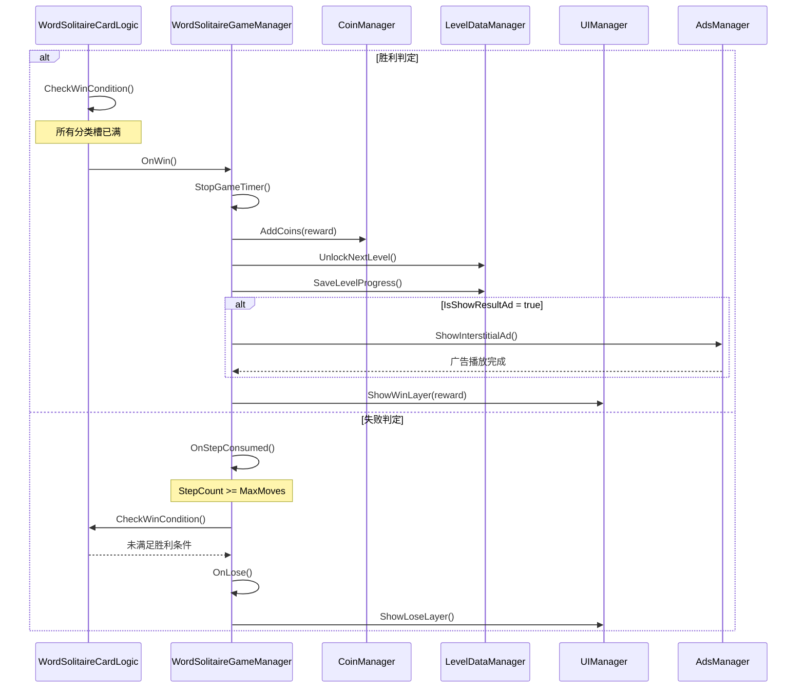
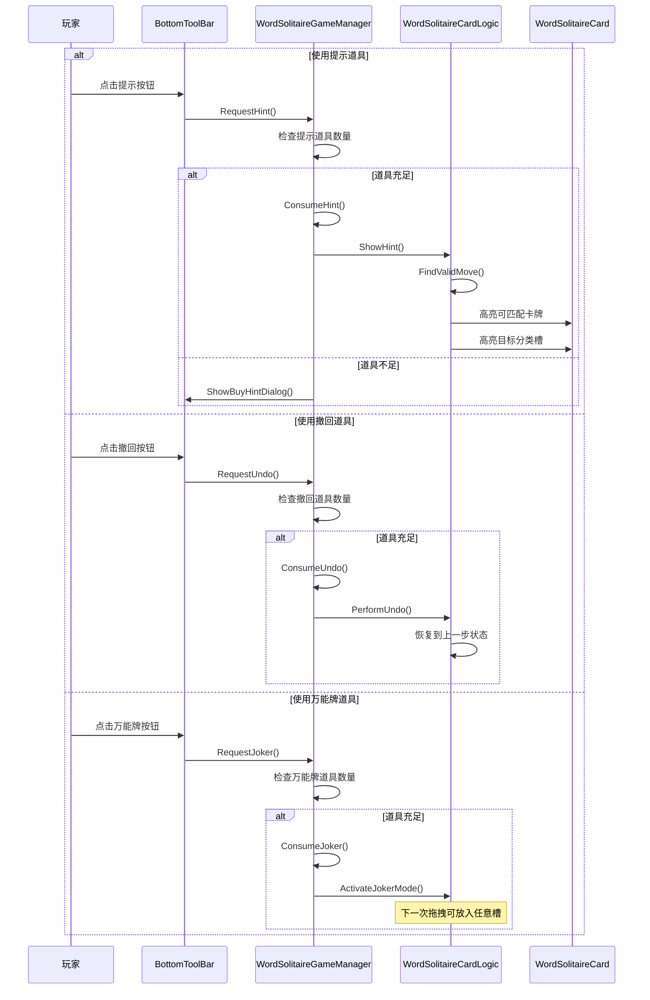

# Word Solitaire 开发计划文档

> **版本**: v1.0  
> **创建日期**: 2026-03-18  
> **项目路径**: `Assets/SimpleSolitaire/Resources/Scripts/Controller/WordSolitaire/`

---

## 一、项目概述

### 1.1 游戏定位

Word Solitaire（词语接龙纸牌）是一款将经典纸牌拖拽玩法与词汇分类知识相结合的休闲益智游戏。玩家在限定步数内，识别单词卡牌的主题类别，将其拖放到正确的分类槽中，清空所有牌堆即可过关。

### 1.2 核心价值

| 维度 | 描述 |
|------|------|
| **娱乐性** | 经典纸牌拖拽玩法，轻松上手，解压休闲 |
| **知识性** | 词汇分类挑战，拓宽知识面，寓教于乐 |
| **挑战性** | 步数限制制，需要策略规划与词汇积累 |
| **全球性** | 英文词库为基础，多语言本地化支持 |

### 1.3 MVP 功能范围

- ✅ 基础玩法（拖拽匹配 + 步数限制）
- ✅ 金币系统（初始金币 + 关卡奖励）
- ✅ 广告系统（激励视频广告集成）
- ⏸️ 道具系统（提示、撤回、万能牌 - 正式版本）
- ⏸️ 内购系统（扩展版本）

---

## 二、技术架构

### 2.1 架构设计原则

1. **继承现有基类**: GameManager、Card、Deck、CardLogic、StatisticsController、UndoPerformer、HintManager
2. **复用现有系统**: GameEventBus（事件总线）、OrientationManager（屏幕适配）、UILayerManager（弹窗管理）
3. **新玩法适配**: 针对词语分类玩法调整卡牌属性、牌堆逻辑、匹配规则

### 2.2 游戏界面布局

基于 WordSolitaireScene.unity 场景结构，游戏界面采用 Canvas-Screen 分层模型，适配移动端竖屏操作：

**整体结构**:
```
GameScene_WordSolitaire
├── Canvas                         # UI根容器
│   ├── GameBG                     # 游戏背景图（可点击切换）
│   ├── Game_BG_Shadow            # 背景阴影层
│   ├── Screen                     # 游戏主屏幕区（上/中/下三段布局）
│   │   ├── Top                    # 顶部信息栏预制体（金币、连击奖励、关卡、设置）
│   │   ├── Center                 # 中心游戏区域（牌桌）
│   │   └── Bottom                 # 底部道具栏预制体（提示、撤回、万能牌）
│   └── 弹窗层（Layers）            # 各类功能弹窗（默认隐藏）
├── EventSystem                    # Unity事件系统
└── Managers                       # 管理器父节点
    ├── WordSolitaireGameManager   # 游戏总控制器
    ├── WordSolitaireCardLogic     # 游戏逻辑控制器
    ├── CoinManager                # 金币管理器
    └── 其他专属管理器
```

**Screen 区域划分**:

| 区域 | Anchors 范围 | 主要功能 | 预制体/组件 |
|------|--------------|----------|-------------|
| **Top** | (0, 0.85) → (1, 1) | 显示金币、连击奖励、关卡数、设置按钮 | Top_WordSolitaire.prefab |
| **Center** | (0, 0.15) → (1, 0.85) | 核心游戏区域，包含步数显示、手牌堆、牌库、分类槽、列区 | WordSolitaireCardLogic 组件 |
| **Bottom** | (0, 0) → (1, 0.15) | 显示道具按钮（提示、撤回、万能牌）及剩余数量 | Bottom_WordSolitaire.prefab |

**Center 内部结构**:
- **UpperSection**（上部区域）: 步数显示（绿色盾牌）、手牌堆（水平堆叠最多3张）、牌库（点击翻牌，显示剩余数量）
- **MiddleSection**（中部区域 - Toolbox）: 空槽位（🏆图标）、分类槽（显示类别名称和进度）
- **LowerSection**（下部区域 - 列区）: 4列卡牌堆叠区域（网格布局），支持卡牌拖拽放置

**预制体资源**:
- `Prefabs/Composite/Top_WordSolitaire.prefab` - 顶部信息栏
- `Prefabs/Composite/Bottom_WordSolitaire.prefab` - 底部道具栏
- `Prefabs/WordSolitaire/CategorySlot.prefab` - 分类槽
- `Prefabs/WordSolitaire/WordCard.prefab` - 词语卡牌

**事件总线（GameEventBus）**:
- Word Solitaire 特有事件：`OnCoinsChanged`、`OnLevelChanged`、`OnHintCountChanged`、`OnUndoCountChanged`、`OnJokerCountChanged`、`OnCategoryMatched`、`OnPackEmpty`、`OnWordSolitaireWin`
- 使用规范：发布者调用 `Publish*()` 方法，订阅者在 `OnEnable`/`OnDisable` 中注册/注销

### 2.3 核心架构图



### 2.4 与传统纸牌游戏的差异

| 维度 | Klondike（传统） | Word Solitaire（新玩法） |
|------|------------------|-------------------------|
| **卡牌属性** | 花色 + 数字 | 单词 + 类别 |
| **匹配规则** | 红黑交替、顺序递减 | 类别匹配 |
| **牌堆类型** | Pack、Waste、Bottom、Ace | Pack、Hand、Column、CategorySlot |
| **步数系统** | 仅统计，无失败条件 | 核心挑战，耗尽即失败 |
| **完成条件** | 所有卡牌移至 Ace 区 | 所有分类槽填满 |

---

## 三、数据结构设计

### 3.1 词库数据结构

```csharp
/// <summary>
/// 词库类别数据
/// </summary>
[CreateAssetMenu(fileName = "Category_New", menuName = "WordSolitaire/WordCategory")]
public class WordCategoryData : ScriptableObject
{
    public string CategoryId;                              // 类别ID
    public string NameKey;                                 // 多语言Key: category_{categoryId}
    public Sprite Icon;                                    // 类别图标
    public List<WordItem> Words;                           // 词汇列表
}

/// <summary>
/// 单词项
/// </summary>
[System.Serializable]
public class WordItem
{
    public string WordId;                                  // 单词ID
    public string CategoryId;                              // 所属类别ID
    public string TextKey;                                 // 多语言Key: word_{wordId}
    public CardType CardType;                              // 卡牌类型（文字/图片/万能卡）
    public Sprite Image;                                   // 图片（仅cardType=image时使用）
}

/// <summary>
/// 卡牌类型
/// </summary>
public enum CardType
{
    Text,      // 文字卡牌
    Image,     // 图片卡牌
    Joker      // 万能卡
}
```

### 3.2 关卡数据结构

```csharp
/// <summary>
/// 关卡配置数据
/// </summary>
[CreateAssetMenu(fileName = "Level_New", menuName = "WordSolitaire/LevelData")]
public class LevelData : ScriptableObject
{
    public int LevelId;                                    // 关卡ID
    public int CardCount;                                  // 卡牌总数
    public int MaxMoves;                                   // 最大步数（999表示无限）
    public int ColumnCount;                                // 列区数量
    public int SlotCount;                                  // 分类槽数量
    public string[] CategoryIds;                          // 涉及的类别（用 | 分隔）
    public bool IsTutorial;                                // 是否引导关卡
    public bool IsShowResultAd;                            // 关卡结算时是否播放插屏广告
    public bool IsShowMatchAd;                             // 第一个分类卡集齐时是否播放插屏广告
}
```

### 3.3 游戏配置数据

```csharp
/// <summary>
/// Word Solitaire 游戏配置
/// </summary>
[CreateAssetMenu(fileName = "WordSolitaireConfig", menuName = "WordSolitaire/GameConfig")]
public class WordSolitaireConfig : ScriptableObject
{
    public int InitialCoins;          // 初始金币
    public int NormalLevelReward;     // 普通关卡奖励
    public int MilestoneLevelReward;  // 里程碑关卡奖励
    public List<int> MilestoneLevels; // 里程碑关卡列表
}
```

---

## 四、核心功能实现方案

### 4.1 卡牌系统

**卡牌类型概述**（基于产品功能文档 2.2 节）：

| 卡牌类型 | 描述 | 显示规则 | MVP 版本 |
|----------|------|----------|----------|
| **文字卡牌** | 显示单词文字，玩家需阅读理解 | 卡牌中间显示单词文本 | ✅ 实现 |
| **图片卡牌** | 仅显示图片，玩家需识图联想 | 卡牌中间显示图片 | ✅ 实现 |
| **分类卡** | 标识某个词组的类别，可拖拽 | 左上角显示分类卡标识，右上角显示 `0/N`，中间显示分类卡文本 | ✅ 实现 |
| **万能卡** | 可归入任意类别槽的特殊卡牌 | 显示万能卡图片，无文本信息 | ✅ 实现 |

**卡牌子类型关系**：
- **单词卡**：包含文字卡牌和图片卡牌，对应具体词汇
- **分类卡**：独立卡牌类型，代表一个类别（如 "Animals"）
- **万能卡**：独立卡牌类型，可匹配任意类别

#### WordSolitaireCard.cs

**关键扩展属性**:
```csharp
public class WordSolitaireCard : Card
{
    [Header("词语卡牌属性")]
    public WordItem WordData;           // 单词数据
    public string CategoryId;           // 所属类别
    public CardType CardType;           // 卡牌类型
    
    // 重写卡牌显示逻辑
    protected override void UpdateCardVisual()
    {
        if (CardType == CardType.Text)
        {
            // 显示文字
            wordText.text = GetCurrentLanguageText();
        }
        else
        {
            // 显示图片
            cardImage.sprite = LoadWordImage();
        }
    }
}
```

#### WordSolitaireDeck.cs

**牌堆类型枚举**:
```csharp
public enum WordDeckType
{
    Pack,          // 牌库
    Hand,          // 手牌区
    Column,        // 列区
    CategorySlot   // 分类槽
}
```

**关键方法**:
```csharp
public class WordSolitaireDeck : Deck
{
    public WordDeckType DeckType;
    public string CategoryId;  // 仅 CategorySlot 使用
    
    /// <summary>
    /// 检查卡牌是否可以放置到此牌堆
    /// </summary>
    public override bool AcceptCard(Card card)
    {
        WordSolitaireCard wordCard = card as WordSolitaireCard;
        
        switch (DeckType)
        {
            case WordDeckType.CategorySlot:
                // 分类槽：类别必须匹配
                return wordCard.CategoryId == CategoryId;
                
            case WordDeckType.Column:
                // 列区：总是接受（用于整理）
                return true;
                
            case WordDeckType.Hand:
                // 手牌区：不接受外部卡牌
                return false;
                
            default:
                return false;
        }
    }
}
```

### 4.2 游戏逻辑

#### WordSolitaireCardLogic.cs

**核心逻辑流程**:
```csharp
public class WordSolitaireCardLogic : CardLogic
{
    public WordDataManager WordDataManager;
    public LevelDataManager LevelDataManager;
    
    private LevelData _currentLevel;
    private List<WordSolitaireDeck> _categorySlots;
    
    /// <summary>
    /// 初始化关卡
    /// </summary>
    public override void InitCardLogic()
    {
        _currentLevel = LevelDataManager.GetCurrentLevel();
        
        // 创建分类槽
        CreateCategorySlots();
        
        // 创建列区
        CreateColumns();
        
        // 创建牌库和手牌区
        CreatePackAndHand();
        
        // 洗牌并分发卡牌
        InitializeCards();
    }
    
    /// <summary>
    /// 卡牌放置逻辑
    /// </summary>
    public void OnCardPlaced(WordSolitaireCard card, WordSolitaireDeck targetDeck)
    {
        if (targetDeck.DeckType == WordDeckType.CategorySlot)
        {
            if (targetDeck.AcceptCard(card))
            {
                // 匹配成功
                OnCardMatched(card, targetDeck);
            }
            else
            {
                // 匹配失败，返回原位
                OnCardMatchFailed(card);
            }
        }
        
        // 消耗步数
        GameManagerComponent.OnStepConsumed();
    }
    
    /// <summary>
    /// 卡牌匹配成功
    /// </summary>
    private void OnCardMatched(WordSolitaireCard card, WordSolitaireDeck slot)
    {
        // 播放成功动画和音效
        PlayMatchSuccessEffect(card);
        
        // 更新槽位进度
        UpdateSlotProgress(slot);
        
        // 检查是否过关
        if (CheckWinCondition())
        {
            GameManagerComponent.OnWin();
        }
    }
}
```

### 4.3 游戏管理器

#### WordSolitaireGameManager.cs

**关键职责**:
```csharp
public class WordSolitaireGameManager : GameManager
{
    [Header("Word Solitaire 组件")]
    [SerializeField] private CoinManager _coinManager;
    [SerializeField] private LevelDataManager _levelDataManager;
    
    private LevelData _currentLevel;
    
    /// <summary>
    /// 步数消耗事件
    /// </summary>
    public void OnStepConsumed()
    {
        _stepCount++;
        GameEventBus.PublishOnStepChanged(_stepCount);
        
        // 检查失败条件
        if (_currentLevel.MaxMoves != 999 && _stepCount >= _currentLevel.MaxMoves)
        {
            if (!CheckWinCondition())
            {
                OnLose();
            }
        }
    }
    
    /// <summary>
    /// 过关处理
    /// </summary>
    protected override void OnWin()
    {
        // 计算金币奖励
        int reward = CalculateLevelReward();
        _coinManager.AddCoins(reward);
        
        // 解锁下一关
        _levelDataManager.UnlockNextLevel();
        
        // 显示胜利弹窗
        ShowWinLayer(reward);
    }
    
    /// <summary>
    /// 失败处理
    /// </summary>
    protected override void OnLose()
    {
        // 显示失败弹窗
        ShowLoseLayer();
    }
}
```

### 4.4 金币系统

#### CoinManager.cs

**核心实现**:
```csharp
public class CoinManager : MonoBehaviour
{
    private const string COINS_KEY = "WordSolitaire_Coins";
    
    private int _currentCoins;
    
    public int CurrentCoins => _currentCoins;
    
    /// <summary>
    /// 初始化金币
    /// </summary>
    public void Initialize(int initialCoins)
    {
        _currentCoins = PlayerPrefs.GetInt(COINS_KEY, initialCoins);
        GameEventBus.PublishOnCoinsChanged(_currentCoins);
    }
    
    /// <summary>
    /// 增加金币
    /// </summary>
    public void AddCoins(int amount)
    {
        _currentCoins += amount;
        SaveCoins();
        GameEventBus.PublishOnCoinsChanged(_currentCoins);
    }
    
    /// <summary>
    /// 消耗金币
    /// </summary>
    public bool SpendCoins(int amount)
    {
        if (_currentCoins >= amount)
        {
            _currentCoins -= amount;
            SaveCoins();
            GameEventBus.PublishOnCoinsChanged(_currentCoins);
            return true;
        }
        return false;
    }
    
    private void SaveCoins()
    {
        PlayerPrefs.SetInt(COINS_KEY, _currentCoins);
        PlayerPrefs.Save();
    }
}
```

---

## 五、Excel 数据转换方案

### 5.1 Excel 表格结构

#### 词库表格（Words.xlsx）

| 列名 | 数据类型 | 说明 | 示例 |
|------|----------|------|------|
| CategoryId | String | 类别ID | animals |
| CategoryName_EN | String | 类别名称（英文） | Animals |
| CategoryName_ZH | String | 类别名称（中文） | 动物 |
| CategoryName_JA | String | 类别名称（日语） | 動物 |
| CategoryName_KO | String | 类别名称（韩语） | 동물 |
| IconPath | String | 图标路径 | CategoryIcons/animals |
| WordId | String | 单词ID | animals_001 |
| Text_EN | String | 单词（英文） | dog |
| Text_ZH | String | 单词（中文） | 狗 |
| Text_JA | String | 单词（日语） | 犬 |
| Text_KO | String | 单词（韩语） | 개 |
| CardType | String | 卡牌类型 | Text |
| ImagePath | String | 图片路径 | WordImages/dog |

#### 关卡表格（Levels.xlsx）

| 列名 | 数据类型 | 说明 | 示例 |
|------|----------|------|------|
| LevelId | Int | 关卡ID | 1 |
| CardCount | Int | 卡牌数量 | 30 |
| MaxMoves | Int | 最大步数 | 999 |
| ColumnCount | Int | 列区数量 | 4 |
| SlotCount | Int | 分类槽数量 | 5 |
| CategoryIds | String | 类别ID列表(用 `\|` 分隔) | animals\|fruits\|colors |
| IsTutorial | Bool | 是否引导关卡 | TRUE |
| IsShowResultAd | Bool | 关卡结算时是否播放插屏广告 | TRUE |
| IsShowMatchAd | Bool | 第一个分类卡集齐时是否播放插屏广告 | FALSE |

### 5.2 转换工具实现

#### ExcelToScriptableObject.cs

```csharp
#if UNITY_EDITOR
using UnityEditor;
using ExcelDataReader;
using System.IO;

public class ExcelToScriptableObject : EditorWindow
{
    [MenuItem("WordSolitaire/Excel 转换工具")]
    public static void ShowWindow()
    {
        GetWindow<ExcelToScriptableObject>("Excel 转换工具");
    }
    
    /// <summary>
    /// 转换词库Excel
    /// </summary>
    public void ConvertWordsExcel(string excelPath, string outputPath)
    {
        // 读取Excel文件
        using (var stream = File.Open(excelPath, FileMode.Open, FileAccess.Read))
        {
            using (var reader = ExcelReaderFactory.CreateReader(stream))
            {
                var result = reader.AsDataSet();
                
                // 按类别分组
                var categories = GroupByCategory(result);
                
                // 创建ScriptableObject
                foreach (var category in categories)
                {
                    CreateWordCategoryAsset(category, outputPath);
                }
            }
        }
        
        AssetDatabase.Refresh();
    }
    
    /// <summary>
    /// 转换关卡Excel
    /// </summary>
    public void ConvertLevelsExcel(string excelPath, string outputPath)
    {
        // 类似实现
    }
    
    /// <summary>
    /// 创建词库资源文件
    /// </summary>
    private void CreateWordCategoryAsset(CategoryData data, string path)
    {
        var asset = ScriptableObject.CreateInstance<WordCategoryData>();
        asset.CategoryId = data.CategoryId;
        // ... 设置其他属性
        
        AssetDatabase.CreateAsset(asset, $"{path}/Category_{data.CategoryId}.asset");
    }
}
#endif
```

### 5.3 转换流程



**开发流程**:
1. 策划在 Excel 中编辑词库和关卡数据
2. 开发者运行 Unity 菜单：`WordSolitaire > Excel 转换工具`
3. 工具自动生成 ScriptableObject 资源文件
4. 资源文件提交到版本控制
5. 游戏运行时通过 Resources.Load 加载

---

## 六、开发任务分解

### 6.1 任务列表

| 任务ID | 任务名称 | 依赖 | 预估时间 | 优先级 |
|--------|----------|------|----------|--------|
| T1 | 创建数据结构 | - | 2小时 | P0 |
| T2 | 实现 Excel 转换工具 | T1 | 3小时 | P0 |
| T3 | 创建核心组件（Card、Deck、CardLogic） | T1 | 5小时 | P0 |
| T4 | 创建游戏管理器和金币系统 | T3 | 4小时 | P0 |
| T5 | 创建辅助组件（Undo、Hint、Statistics） | T3 | 3小时 | P1 |
| T6 | 创建数据管理器（Word、Level、Coin） | T1 | 4小时 | P0 |
| T7 | 创建 UI 组件和弹窗 | T4 | 6小时 | P0 |
| T8 | 创建预制体资源（Top、Bottom、CategorySlot、WordCard） | T3 | 4小时 | P0 |

**总预估**: 31小时（约4-5个工作日）

### 6.2 详细任务说明

#### T1: 创建数据结构

**输出文件**:
- `WordCategoryData.cs` - 词库数据 ScriptableObject
- `LevelData.cs` - 关卡数据 ScriptableObject
- `WordSolitaireConfig.cs` - 游戏配置 ScriptableObject

**关键点**:
- 使用 `[CreateAssetMenu]` 特性支持编辑器创建
- 实现 `ISerializationCallbackReceiver` 处理 Dictionary 序列化
- 数据结构预留扩展字段

#### T2: 实现 Excel 转换工具

**输出文件**:
- `Editor/ExcelToScriptableObject.cs` - 编辑器窗口工具

**依赖库**:
- ExcelDataReader（Unity Package）

**关键点**:
- 支持批量转换（Categories.csv, Words.csv, Levels.csv）
- 自动创建资源文件夹结构
- 提供转换日志和错误提示
- 支持新的数据结构（移除难度字段，新增广告控制字段）

**数据验证规则**:
- Categories.csv: 验证 categoryId, nameKey, iconPath 字段完整性
- Words.csv: 验证 wordId, categoryId, textKey, cardType 字段完整性，移除hintKey验证
- Levels.csv: 验证 levelId, cardCount, maxMoves, categoryIds 等基础字段，新增 IsShowResultAd, IsShowMatchAd 字段验证

#### T3: 创建核心组件

**输出文件**:
- `WordSolitaireCard.cs` - 词语卡牌
- `WordSolitaireDeck.cs` - 词语牌堆
- `WordSolitaireCardLogic.cs` - 核心游戏逻辑

**关键点**:
- 继承现有基类
- 重写关键方法（AcceptCard、UpdateCardVisual）
- 实现类别匹配逻辑

#### T4: 创建游戏管理器和金币系统

**输出文件**:
- `WordSolitaireGameManager.cs` - 游戏管理器
- `Data/CoinManager.cs` - 金币管理器

**关键点**:
- 集成步数限制和胜负判定
- 实现金币奖励和持久化存储
- 通过 GameEventBus 发布事件

#### T5: 创建辅助组件

**输出文件**:
- `WordSolitaireUndoPerformer.cs` - 撤销系统
- `WordSolitaireHintManager.cs` - 提示系统
- `WordSolitaireStatisticsController.cs` - 统计控制器

**关键点**:
- 实现游戏状态快照保存
- 实现可匹配卡牌高亮
- 记录关卡最佳成绩

#### T6: 创建数据管理器

**输出文件**:
- `Data/WordDataManager.cs` - 词库管理器
- `Data/LevelDataManager.cs` - 关卡管理器
- `Data/LocalizationManager.cs` - 多语言管理器（可选）

**WordDataManager 职责**:
- 从 Resources 加载所有 WordCategoryData ScriptableObject
- 提供按类别ID获取词库数据接口
- 支持运行时动态加载指定类别词汇

**LevelDataManager 职责**:
- 从 Resources 加载所有 LevelData ScriptableObject
- 管理关卡进度存档（PlayerPrefs）
- 提供当前关卡、下一关获取逻辑
- 实现关卡解锁逻辑

**关键点**:
- 使用单例模式或依赖注入
- 数据懒加载，避免启动时加载所有资源
- 提供关卡完成状态查询接口
- 支持关卡重置功能

#### T7: 创建 UI 组件

**输出文件**:
- `UI/WordSolitaireGameLayerUI.cs` - 游戏选项弹窗（暂停/设置）
- `UI/WordSolitaireWinLayerUI.cs` - 胜利弹窗
- `UI/WordSolitaireLoseLayerUI.cs` - 失败弹窗
- `UI/WordSolitaireSettingLayerUI.cs` - 设置弹窗
- `UI/Components/TopInfoBar.cs` - 顶部信息栏组件
- `UI/Components/BottomToolBar.cs` - 底部道具栏组件

**游戏选项弹窗（GameLayerUI）**:
- 显示暂停菜单：继续游戏、重新开始、返回主菜单
- 集成设置入口
- 通过 GameLayerMediator 调用显示

**胜利弹窗（WinLayerUI）**:
- 显示关卡完成信息
- 显示获得金币奖励
- 提供下一关、重玩、返回主菜单按钮
- 触发插屏广告（根据 IsShowResultAd 配置）

**失败弹窗（LoseLayerUI）**:
- 显示步数耗尽提示
- 提供重试、返回主菜单按钮
- 可选：显示观看广告获得额外步数

**设置弹窗（SettingLayerUI）**:
- 音量控制（音乐、音效）
- 语言切换
- 振动开关

**顶部信息栏组件（TopInfoBar）**:
- 显示金币数量（带图标）
- 显示当前关卡
- 设置按钮
- 通过 GameEventBus 监听金币变化事件

**底部道具栏组件（BottomToolBar）**:
- 提示按钮（显示剩余数量）
- 撤回按钮（显示剩余数量）
- 万能牌按钮（显示剩余数量）
- 道具点击事件绑定

**关键点**:
- 所有弹窗继承 UILayerBase
- 集成 UILayerManager 系统管理弹窗堆栈
- 支持竖屏/横屏适配（使用 OrientationManager）
- 通过 GameEventBus 实现UI与逻辑的解耦
- 预制体引用通过 Inspector 配置

#### T8: 创建预制体资源

**输出文件**:
- `Prefabs/Composite/Top_WordSolitaire.prefab` - 顶部信息栏预制体
- `Prefabs/Composite/Bottom_WordSolitaire.prefab` - 底部道具栏预制体
- `Prefabs/WordSolitaire/CategorySlot.prefab` - 分类槽预制体
- `Prefabs/WordSolitaire/WordCard.prefab` - 词语卡牌预制体
- `Prefabs/WordSolitaire/EmptySlot.prefab` - 空槽位预制体（奖杯图标）
- `Prefabs/WordSolitaire/PackDeck.prefab` - 牌库预制体（含卡背堆叠效果）

**关键点**:
- 预制体结构需符合场景节点说明中的布局要求
- 使用 Anchor 驱动布局，适配竖屏/横屏切换
- 集成必要的 UI 组件（Image、Text、Button 等）
- 配置事件监听器（如按钮点击、拖拽接口）
- 测试竖屏和横屏两种模式下的显示效果

---

## 七、目录结构

### 7.1 代码目录

```
Assets/SimpleSolitaire/Resources/Scripts/Controller/WordSolitaire/
├── WordSolitaireGameManager.cs
├── WordSolitaireCard.cs
├── WordSolitaireDeck.cs
├── WordSolitaireCardLogic.cs
├── WordSolitaireUndoPerformer.cs
├── WordSolitaireHintManager.cs
├── WordSolitaireStatisticsController.cs
├── Data/
│   ├── WordDataManager.cs
│   ├── LevelDataManager.cs
│   ├── CoinManager.cs
│   └── LocalizationManager.cs
├── Editor/
│   └── ExcelToScriptableObject.cs
└── UI/
    ├── WordSolitaireGameLayerUI.cs
    ├── WordSolitaireWinLayerUI.cs
    ├── WordSolitaireLoseLayerUI.cs
    ├── WordSolitaireSettingLayerUI.cs
    └── Components/
        ├── TopInfoBar.cs
        └── BottomToolBar.cs
```

### 7.2 数据资源目录

**数据文件路径**（基于场景节点说明 9.1 节）：

| 数据类型 | 资源路径 | 格式 | 说明 |
|----------|----------|------|------|
| **词库数据** | `Resources/Data/WordSolitaire/Words/` | ScriptableObject | 词库类别数据文件（.asset） |
| **关卡数据** | `Resources/Data/WordSolitaire/Levels/` | ScriptableObject | 关卡配置数据文件（.asset） |
| **分类图标** | `Resources/Sprites/WordSolitaire/CategoryIcons/` | Sprite | 类别图标图片（.png） |
| **词语图片** | `Resources/Sprites/WordSolitaire/WordImages/` | Sprite | 图片卡牌对应的图片资源 |
| **卡牌背景** | `Resources/Sprites/WordSolitaire/Cards/` | Sprite | 卡牌背景、边框等通用素材 |
| **Excel 源文件** | `Resources/Data/WordSolitaire/Config/ExcelSource/` | Excel | 原始数据表格（Words.xlsx, Levels.xlsx, Categories.xlsx） |

**目录结构**：
```
Assets/SimpleSolitaire/Resources/Data/WordSolitaire/
├── Words/                           # 词库数据
│   ├── Category_Animals.asset
│   ├── Category_Fruits.asset
│   └── ... (共30个类别)
├── Levels/                          # 关卡数据
│   ├── Level_01.asset
│   ├── Level_02.asset
│   └── ... (共20关)
├── Config/                          # 配置文件
│   ├── WordSolitaireConfig.asset
│   └── ExcelSource/                 # Excel 源文件
│       ├── Words.xlsx               # 词库表格
│       ├── Levels.xlsx              # 关卡表格
│       └── Categories.xlsx          # 类别定义表格
└── (运行时生成数据)
```

**Excel 数据源**：
- **Words.xlsx**: 词库表格，包含单词、类别、难度等信息
- **Levels.xlsx**: 关卡配置表格，定义关卡参数和词组分配
- **Categories.xlsx**: 类别定义表格，管理分类元数据（类别名称、图标、难度等）

### 7.3 图片资源目录

```
Assets/SimpleSolitaire/Resources/Sprites/WordSolitaire/
├── CategoryIcons/
│   ├── animals.png
│   ├── fruits.png
│   └── ...
├── WordImages/
│   ├── dog.png
│   ├── cat.png
│   └── ...
└── Cards/
    ├── card_bg_text.png
    └── card_bg_image.png
```

---

## 八、性能优化建议

### 8.1 数据加载优化

**内存预算**:
- 词库数据：约 5-10MB（30个类别，每类20-30个词汇）
- 关卡数据：约 0.5MB（20个关卡配置）
- 图片资源：约 20-30MB（类别图标 + 图片卡牌）
- 总内存预算：控制在 50MB 以内

**加载策略**:
- ✅ 词库数据在游戏启动时一次性加载到内存
- ✅ 使用 `Resources.LoadAsync` 异步加载图片资源
- ✅ 图片资源使用 Sprite Atlas 打包（按类别分Atlas）
- ✅ 关卡数据按需加载，切换关卡时异步加载
- ✅ 使用 Addressables 系统管理大型资源（可选）

**预加载机制**:
```csharp
// 启动时预加载词库数据
public class WordDataManager : MonoBehaviour
{
    private Dictionary<string, WordCategoryData> _categoriesCache;
    
    public async Task PreloadCategories()
    {
        var loadTasks = new List<Task>();
        foreach (var categoryId in _categoryIds)
        {
            loadTasks.Add(LoadCategoryAsync(categoryId));
        }
        await Task.WhenAll(loadTasks);
    }
}
```

### 8.2 运行时优化

**对象池实现**:
```csharp
public class CardObjectPool : MonoBehaviour
{
    [SerializeField] private WordSolitaireCard _cardPrefab;
    [SerializeField] private int _poolSize = 100;
    
    private Queue<WordSolitaireCard> _pool = new Queue<WordSolitaireCard>();
    
    public void Initialize()
    {
        for (int i = 0; i < _poolSize; i++)
        {
            var card = Instantiate(_cardPrefab, transform);
            card.gameObject.SetActive(false);
            _pool.Enqueue(card);
        }
    }
    
    public WordSolitaireCard GetCard()
    {
        if (_pool.Count > 0)
        {
            var card = _pool.Dequeue();
            card.gameObject.SetActive(true);
            return card;
        }
        return Instantiate(_cardPrefab);
    }
    
    public void ReturnCard(WordSolitaireCard card)
    {
        card.gameObject.SetActive(false);
        card.transform.SetParent(transform);
        _pool.Enqueue(card);
    }
}
```

**优化项**:
- ✅ 卡牌对象池管理，避免频繁实例化/销毁（池大小：100个）
- ✅ 使用对象池管理粒子效果（池大小：20个）
- ✅ 优化 UI 刷新频率（避免每帧更新，使用事件驱动）
- ✅ 卡牌拖拽使用射线检测优化（LayerMask 过滤）
- ✅ 动画使用 DOTween 或 Unity 动画系统，避免 Update 中手动计算

### 8.3 内存优化

**资源卸载策略**:
- ✅ 未使用的卡牌图片及时卸载（关卡结束后）
- ✅ 使用 `Resources.UnloadUnusedAssets` 清理资源（切换场景时）
- ✅ 限制同时加载的关卡数量（只加载当前关卡数据）
- ✅ 图片资源使用压缩格式（ETC2/ASTC for 移动端）
- ✅ 大图片使用 Mipmap 优化渲染性能

**内存监控**:
```csharp
public class MemoryMonitor : MonoBehaviour
{
    private void Update()
    {
        #if UNITY_EDITOR
        if (Input.GetKeyDown(KeyCode.M))
        {
            long totalMemory = GC.GetTotalMemory(false);
            long textureMemory = UnityEngine.Profiling.Profiler.GetTotalAllocatedMemoryLong();
            Debug.Log($"[Memory] GC: {totalMemory / 1024 / 1024}MB, Texture: {textureMemory / 1024 / 1024}MB");
        }
        #endif
    }
}
```

---

## 九、测试计划

### 9.1 单元测试

| 测试项 | 测试内容 | 测试步骤 | 预期结果 |
|--------|----------|----------|----------|
| **数据加载** | Excel 转换正确性 | 1. 运行 Excel 转换工具<br>2. 检查生成的 ScriptableObject<br>3. 验证字段完整性 | 所有 CSV 数据正确转换为 SO，无缺失字段 |
| **数据加载** | ScriptableObject 加载 | 1. 调用 WordDataManager.LoadCategories()<br>2. 检查返回数据 | 返回 30 个类别数据，无 null 值 |
| **卡牌匹配** | 类别匹配逻辑 | 1. 创建测试卡牌（CategoryId=animals）<br>2. 拖放到 animals 分类槽<br>3. 拖放到 fruits 分类槽 | animals 槽接受，fruits 槽拒绝 |
| **卡牌匹配** | 万能卡匹配 | 1. 创建万能卡<br>2. 拖放到任意分类槽 | 任意分类槽都接受 |
| **步数系统** | 步数消耗 | 1. 记录初始步数<br>2. 执行一次有效拖拽<br>3. 检查步数变化 | 步数正确减 1 |
| **步数系统** | 失败判定 | 1. 设置 maxMoves=5<br>2. 执行 5 次无效操作<br>3. 检查游戏状态 | 触发失败弹窗 |
| **金币系统** | 金币增减 | 1. 记录初始金币<br>2. 调用 AddCoins(100)<br>3. 调用 SpendCoins(50) | 金币先增后减，数值正确 |
| **金币系统** | 持久化存储 | 1. 修改金币数量<br>2. 重启游戏<br>3. 读取金币 | 金币数量保持一致 |

**测试数据准备**:
```csharp
// 测试用例数据
public static class TestData
{
    public static WordItem CreateTestWord(string categoryId, CardType type)
    {
        return new WordItem
        {
            WordId = $"test_{categoryId}_001",
            CategoryId = categoryId,
            TextKey = $"word_test_{categoryId}",
            CardType = type
        };
    }
    
    public static LevelData CreateTestLevel()
    {
        var level = ScriptableObject.CreateInstance<LevelData>();
        level.LevelId = 999;
        level.CardCount = 10;
        level.MaxMoves = 5;
        level.CategoryIds = new[] { "animals", "fruits" };
        return level;
    }
}
```

### 9.2 集成测试

| 测试项 | 测试内容 | 测试步骤 | 预期结果 |
|--------|----------|----------|----------|
| **关卡流程** | 完整游戏流程 | 1. 进入关卡<br>2. 拖拽所有卡牌到正确槽位<br>3. 验证过关 | 显示胜利弹窗，金币增加，解锁下一关 |
| **关卡流程** | 失败重试 | 1. 耗尽所有步数<br>2. 点击重试<br>3. 验证关卡重置 | 关卡重新开始，步数重置 |
| **数据持久化** | 关卡进度 | 1. 完成关卡 1-3<br>2. 关闭游戏<br>3. 重新启动<br>4. 检查关卡解锁状态 | 关卡 1-4 已解锁 |
| **数据持久化** | 金币持久化 | 1. 获得 100 金币<br>2. 关闭游戏<br>3. 重新启动 | 金币显示 100 |
| **UI 交互** | 弹窗显示 | 1. 点击暂停按钮<br>2. 验证弹窗内容<br>3. 点击继续 | 弹窗正确显示/隐藏 |
| **UI 交互** | 按钮响应 | 1. 点击设置按钮<br>2. 修改音量<br>3. 验证设置生效 | 音量设置正确保存 |
| **广告集成** | 激励视频 | 1. 触发广告播放<br>2. 完成观看<br>3. 验证奖励发放 | 金币/道具正确增加 |

**自动化测试方案**:
```csharp
// 使用 Unity Test Framework
public class WordSolitairePlayModeTests
{
    [UnityTest]
    public IEnumerator Test_CompleteLevel()
    {
        // 加载测试场景
        SceneManager.LoadScene("WordSolitaireTestScene");
        yield return new WaitForSeconds(1);
        
        // 获取游戏管理器
        var gameManager = Object.FindObjectOfType<WordSolitaireGameManager>();
        
        // 模拟完成所有匹配
        var cardLogic = Object.FindObjectOfType<WordSolitaireCardLogic>();
        cardLogic.ForceCompleteAllMatches();
        
        // 等待胜利弹窗
        yield return new WaitForSeconds(0.5f);
        
        // 验证胜利状态
        Assert.IsTrue(gameManager.IsWin);
    }
}
```

### 9.3 兼容性测试

| 测试项 | 测试内容 | 测试环境 | 通过标准 |
|--------|----------|----------|----------|
| **屏幕适配** | 竖屏/横屏切换 | iPhone 14 Pro (竖屏→横屏) | UI 元素正确重新布局，无重叠 |
| **屏幕适配** | 不同分辨率 | iPhone SE / iPhone 14 Pro Max / iPad Pro | 所有元素可见，按钮可点击 |
| **多语言** | 英语 | 系统语言设为 English | 所有文本显示英文 |
| **多语言** | 中文 | 系统语言设为 简体中文 | 所有文本显示中文 |
| **多语言** | 日语 | 系统语言设为 日本語 | 所有文本显示日文 |
| **多语言** | 韩语 | 系统语言设为 한국어 | 所有文本显示韩文 |
| **平台兼容** | iOS | iPhone 12, iOS 16+ | 流畅运行，无崩溃 |
| **平台兼容** | Android | Samsung S21, Android 12+ | 流畅运行，无崩溃 |
| **平台兼容** | PC | Windows 10, 1920x1080 | 流畅运行，无崩溃 |

**测试设备清单**:
- iOS: iPhone SE (3rd), iPhone 12, iPhone 14 Pro, iPad Pro 11"
- Android: Samsung Galaxy S21, Xiaomi 13, Huawei P50
- PC: Windows 10/11, macOS Ventura

---

## 十、游戏流程时序图

### 10.1 关卡初始化流程



**流程说明**:
1. 玩家点击开始关卡
2. 游戏管理器从 LevelDataManager 获取当前关卡配置
3. 从 WordDataManager 获取关卡所需的词库数据
4. CardLogic 初始化游戏区域（分类槽、列区、牌库、手牌）
5. 根据关卡配置创建并分发卡牌
6. 显示游戏 HUD，开始计时

### 10.2 卡牌拖拽匹配流程



**流程说明**:
1. 玩家开始拖拽卡牌，记录原始位置
2. 拖拽过程中实时更新卡牌位置
3. 拖拽结束时进行射线检测，找到目标牌堆
4. CardLogic 验证卡牌类别与槽位是否匹配
5. 匹配成功：添加卡牌、播放特效、消耗步数、检查胜利条件
6. 匹配失败：卡牌返回原始位置，播放失败特效

### 10.3 胜负判定流程



**流程说明**:

**胜利流程**:
1. CardLogic 检查所有分类槽是否已满
2. 调用 GameManager.OnWin()
3. 停止游戏计时器
4. 计算并发放金币奖励
5. 解锁下一关并保存进度
6. 根据配置播放插屏广告
7. 显示胜利弹窗

**失败流程**:
1. 步数消耗达到上限
2. 检查是否满足胜利条件
3. 未满足则触发 OnLose()
4. 显示失败弹窗

### 10.4 道具使用流程



**流程说明**:
1. 玩家点击底部道具栏按钮
2. 检查道具数量是否充足
3. 消耗道具并执行对应功能
4. 提示：高亮显示可匹配卡牌和目标槽
5. 撤回：恢复到上一步游戏状态
6. 万能牌：激活万能模式，下一次拖拽可放入任意分类槽

## 十一、风险与注意事项

### 11.1 技术风险

| 风险 | 影响 | 应对措施 |
|------|------|----------|
| Excel 解析库兼容性 | 高 | 使用成熟的 ExcelDataReader 库，测试多平台兼容性 |
| 多语言 Key 管理 | 中 | 建立 Key 命名规范，使用工具检查缺失的本地化文本 |
| 广告 SDK 集成 | 中 | 使用 Google Mobile Ads SDK，测试激励视频回调可靠性 |
| 内存占用过大 | 中 | 使用对象池、异步加载、Sprite Atlas 压缩 |
| 卡牌拖拽性能 | 低 | 优化射线检测（LayerMask），使用对象池 |

### 11.2 广告集成注意事项

**激励视频广告**:
- 必须在广告播放完成后才发放奖励
- 处理用户提前关闭广告的情况（不发放奖励）
- 广告加载失败时提供备用方案（如直接给予奖励或提示稍后重试）
- 测试广告在不同网络条件下的表现

**插屏广告**:
- 根据关卡配置 `IsShowResultAd` 和 `IsShowMatchAd` 控制显示时机
- 避免在游戏过程中突然弹出插屏广告
- 确保广告不会导致游戏状态异常
- 测试广告关闭后的游戏恢复逻辑

**广告配置示例**:
```csharp
public class AdsManager : MonoBehaviour
{
    public void ShowRewardedAd(Action onRewarded, Action onFailed)
    {
        // 加载激励视频
        // 播放完成后调用 onRewarded()
        // 失败或提前关闭调用 onFailed()
    }
    
    public void ShowInterstitialAd(Action onClosed)
    {
        // 显示插屏广告
        // 关闭后调用 onClosed() 恢复游戏
    }
}
```

### 11.3 多语言实现注意事项

**Key 管理**:
- 严格遵循命名规范：`category_{id}`、`word_{id}`、`hint_{id}`、`level_{id}_desc`
- 使用工具脚本检查 CSV 中所有 Key 在 Localization.csv 中存在
- 缺失 Key 时使用英文作为 fallback，并记录警告日志

**动态语言切换**:
- 游戏运行时支持语言切换（通过设置界面）
- 切换语言后刷新所有 UI 文本
- 已加载的卡牌文本需要重新获取本地化内容

**本地化实现示例**:
```csharp
public class LocalizationManager
{
    private static Dictionary<string, string> _currentTexts;
    private static SystemLanguage _currentLanguage;
    
    public static void SetLanguage(SystemLanguage language)
    {
        _currentLanguage = language;
        LoadLocalizationFile(language);
        // 触发语言变更事件
        GameEventBus.PublishOnLanguageChanged();
    }
    
    public static string Get(string key)
    {
        if (_currentTexts.TryGetValue(key, out string value))
            return value;
        
        Debug.LogWarning($"[Localization] Key not found: {key}");
        return key; // fallback
    }
}
```

### 11.4 数据安全注意事项

**金币数据保护**:
- 使用 PlayerPrefs 存储时进行简单加密（如 XOR 或 Base64）
- 考虑使用更安全的存储方案（如本地 SQLite 加密）
- 敏感操作（金币修改）添加校验机制

**存档数据备份**:
- 关卡进度定期自动保存
- 提供手动保存/加载功能（用于测试）
- 数据损坏时提供重置选项

### 11.5 开发注意事项

1. **数据安全**:
   - 金币数据使用 PlayerPrefs 加密存储
   - 关卡进度使用 JSON 序列化后存储
   - 定期备份存档数据

2. **屏幕适配**:
   - 继承现有 OrientationManager 系统
   - 创建专门的 OrientationDataContainer 配置
   - 必须测试竖屏和横屏两种模式
   - UI 元素使用 Anchor 驱动布局

3. **代码规范**:
   - 遵循现有项目的命名空间约定（SimpleSolitaire.Controller）
   - 使用 `[SerializeField]` 暴露私有字段
   - 所有代码注释使用中文
   - 公共方法添加 XML 文档注释

4. **扩展性预留**:
   - 词库数据结构预留扩展字段（音频路径、动画等）
   - 关卡配置支持无限关卡循环（levelId > 预定义关卡时使用随机生成）
   - 金币系统预留道具购买接口
   - 事件系统预留扩展事件类型

---

## 十二、后续扩展规划

### 12.1 正式版本（P1）

- 道具系统（提示、撤回、万能牌、额外步数）
- 扩展词库至200个类别
- 多语言扩展（法语、德语、西班牙语）
- 商店界面

### 12.2 扩展版本（P2）

- Hard 难度词库
- 无限循环关卡
- 内购系统
- 排行榜

---

## 附录：参考资料

### A. 相关文档

- 《词语联想接龙-产品功能文档.md》 - 产品功能需求基准
- 《WordSolitaire 场景节点说明.md》 - 场景结构与节点配置
- 《CODEBUDDY.md》 - 项目架构说明

### B. 参考代码

- `Assets/SimpleSolitaire/Resources/Scripts/Controller/Klondike/` - Klondike 完整实现
- `Assets/SimpleSolitaire/Resources/Scripts/Controller/Base/` - 基类定义

### C. 第三方库

- ExcelDataReader - Excel 文件解析库
- Newtonsoft.Json - JSON 序列化库

---

*文档结束 - 开发计划已确认固化*
