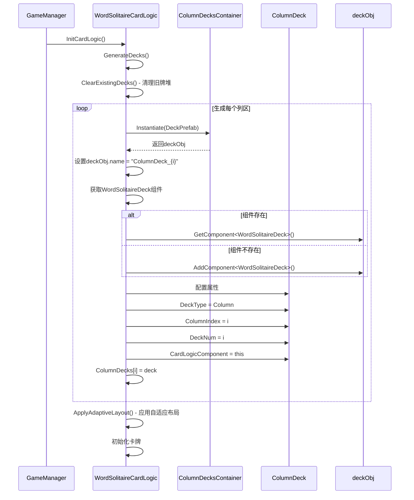
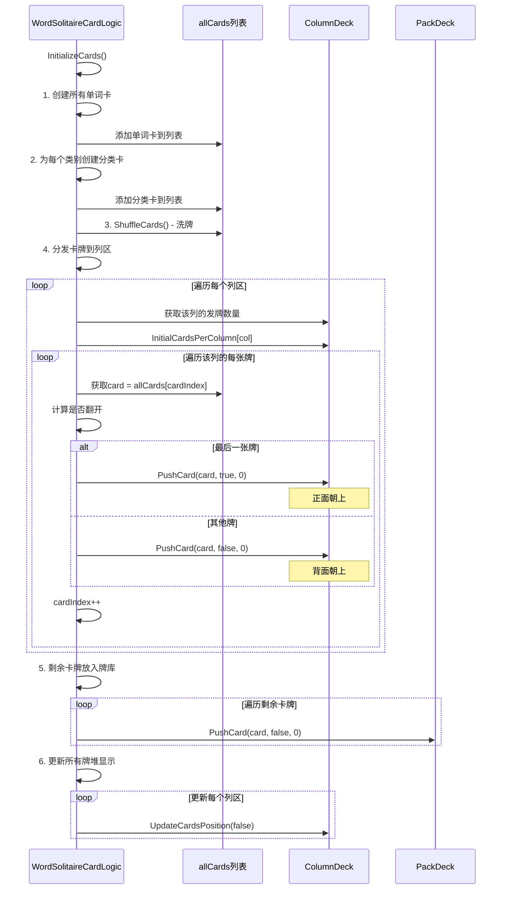
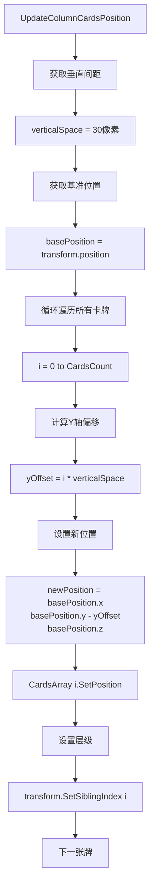
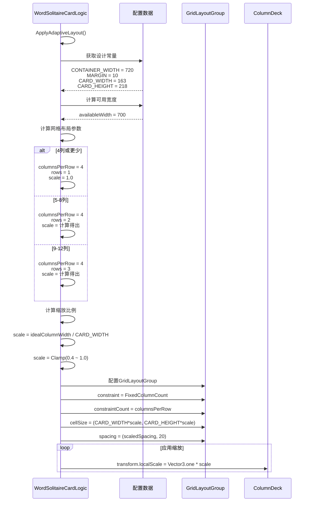
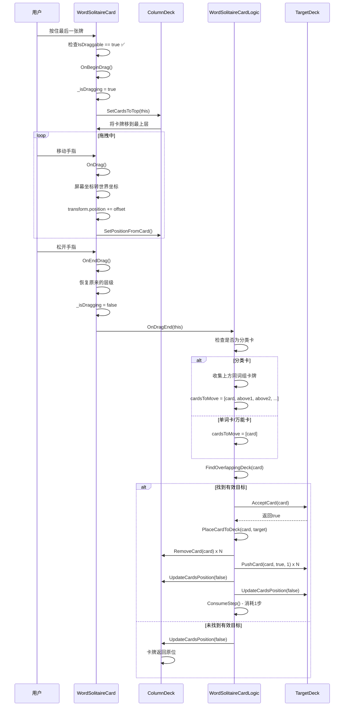
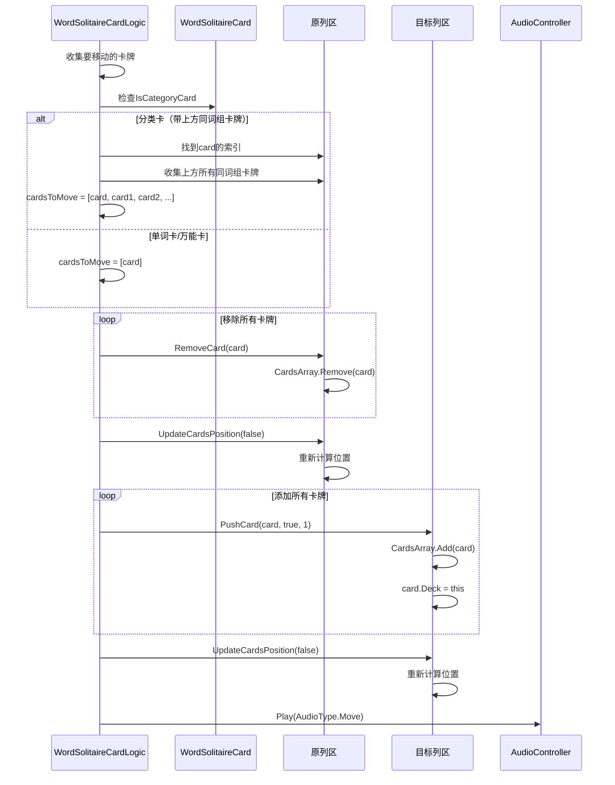
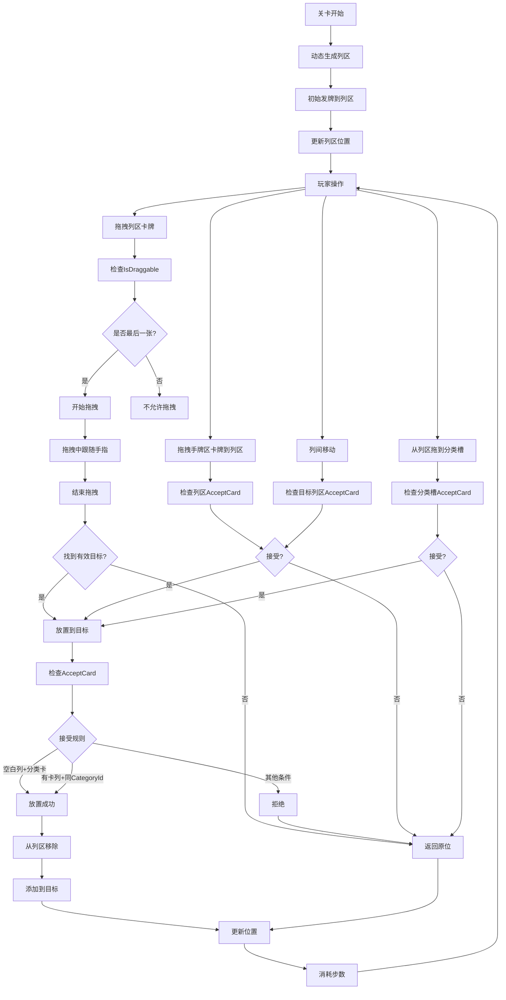

# 列区时序流程文档

## 文档版本

- **版本**: v1.0
- **创建日期**: 2026-03-23
- **作者**: AI Assistant
- **适用项目**: Word Solitaire (词语联想接龙)

---

## 目录

1. [列区概述](#1-列区概述)
2. [动态创建流程](#2-动态创建流程)
3. [初始发牌流程](#3-初始发牌流程)
4. [卡牌排列逻辑](#4-卡牌排列逻辑)
5. [自适应布局](#5-自适应布局)
6. [拖拽取牌流程](#6-拖拽取牌流程)
7. [放置卡牌流程](#7-放置卡牌流程)
8. [分类卡连带移动](#8-分类卡连带移动)
9. [AcceptCard规则](#9-acceptcard规则)
10. [卡牌翻牌逻辑](#10-卡牌翻牌逻辑)
11. [UI显示逻辑](#11-ui显示逻辑)
12. [事件流程汇总](#12-事件流程汇总)
13. [产品规则对照](#13-产品规则对照)
14. [注意事项](#14-注意事项)
15. [相关文件](#15-相关文件)
16. [更新记录](#16-更新记录)

---

## 1. 列区概述

### 1.1 定义

列区（Column）是Word Solitaire游戏中用于存放和操作卡牌的主要区域。玩家可以将分类卡放在空白列区作为起始，然后将同词组的单词卡放在分类卡上。列区采用垂直堆叠方式显示卡牌。

### 1.2 节点结构

**场景路径**: `Screen/Center/LowerSection/ColumnDecksContainer`

```
ColumnDecksContainer (列区容器) ⭐ GridLayoutGroup组件
    ├── ColumnDeck_0 (列1) ⭐ WordSolitaireDeck组件
    ├── ColumnDeck_1 (列2) ⭐ WordSolitaireDeck组件
    ├── ColumnDeck_2 (列3) ⭐ WordSolitaireDeck组件
    └── ColumnDeck_3 (列4) ⭐ WordSolitaireDeck组件
```

**组件挂载**:
- `WordSolitaireDeck` - 列区控制器
- `RectTransform` - 位置和大小配置
- `GridLayoutGroup` - 网格布局（ColumnDecksContainer）

### 1.3 动态生成

**关键特征**:
- ❌ **不是预制置的静态节点**
- ✅ **运行时动态生成**
- ✅ **数量由关卡配置决定**

**生成位置**: `WordSolitaireCardLogic.GenerateColumnDecks()`

### 1.4 核心属性

```csharp
// WordSolitaireDeck.cs
public enum WordDeckType
{
    Pack,           // 牌库
    Hand,           // 手牌区
    Column,         // 列区
    CategorySlot    // 分类槽
}

public WordDeckType DeckType = WordDeckType.Column;  // 列区类型
public int ColumnIndex;  // 列索引（0, 1, 2, 3...）
public int DeckNum;      // 牌堆编号
```

### 1.5 卡牌索引规则

**CardsArray结构**:
- 索引0: 最顶部的卡牌（最早放入列区的）
- 索引CardsCount-1: 最底部的卡牌（最后放入列区的）

**示例**（5张牌）:
```
CardsArray索引: [0] [1] [2] [3] [4]
                  ↓   ↓   ↓   ↓   ↓
              最顶 → 最底
```

**视觉位置**:
- 索引0: 最上方
- 索引CardsCount-1: 最下方

---

## 2. 动态创建流程

### 2.1 创建时序



### 2.2 创建代码流程

```csharp
// WordSolitaireCardLogic.cs - GenerateColumnDecks方法
private void GenerateColumnDecks()
{
    if (ColumnDecksContainer == null) return;
    
    // 1. 获取列区数量
    int columnCount = _currentLevel.ColumnCount;
    if (columnCount <= 0) columnCount = 4; // 默认4列
    
    ColumnDecks = new WordSolitaireDeck[columnCount];
    
    // 2. 循环创建每个列区
    for (int i = 0; i < columnCount; i++)
    {
        // 实例化Deck预制体
        GameObject deckObj = Instantiate(DeckPrefab, ColumnDecksContainer);
        deckObj.name = $"ColumnDeck_{i}";
        
        // 获取或添加WordSolitaireDeck组件
        WordSolitaireDeck deck = deckObj.GetComponent<WordSolitaireDeck>();
        if (deck == null)
        {
            deck = deckObj.AddComponent<WordSolitaireDeck>();
        }
        
        // 3. 配置列区属性
        deck.DeckType = WordDeckType.Column;  // 设置为列区类型
        deck.ColumnIndex = i;                 // 列索引
        deck.DeckNum = i;                     // 牌堆编号
        deck.CardLogicComponent = this;         // 引用卡牌逻辑控制器
        
        ColumnDecks[i] = deck;
    }
}
```

### 2.3 关键配置

| 配置项 | 值 | 说明 |
|-------|---|------|
| **DeckType** | `WordDeckType.Column` | 列区类型标识 |
| **ColumnIndex** | 0, 1, 2, 3... | 列索引，从左到右 |
| **DeckNum** | 0, 1, 2, 3... | 牌堆编号 |
| **CardLogicComponent** | WordSolitaireCardLogic实例 | 引用卡牌逻辑控制器 |

### 2.4 清理旧牌堆

```csharp
// WordSolitaireCardLogic.cs - ClearExistingDecks方法
private void ClearExistingDecks()
{
    // 清理分类槽
    if (CategorySlots != null)
    {
        foreach (var slot in CategorySlots)
        {
            if (slot != null && slot.gameObject != null)
            {
                Destroy(slot.gameObject);
            }
        }
        CategorySlots = null;
    }
    
    // 清理列区
    if (ColumnDecks != null)
    {
        foreach (var deck in ColumnDecks)
        {
            if (deck != null && deck.gameObject != null)
            {
                Destroy(deck.gameObject);
            }
        }
        ColumnDecks = null;
    }
}
```

---

## 3. 初始发牌流程

### 3.1 发牌时序



### 3.2 发牌代码流程

```csharp
// WordSolitaireCardLogic.cs - InitializeCards方法
// 4. 分发卡牌到列区（根据 InitialCardsPerColumn 配置）
int cardIndex = 0;
if (ColumnDecks != null && _currentLevel.InitialCardsPerColumn != null)
{
    // 遍历每个列区
    for (int col = 0; col < ColumnDecks.Length && col < _currentLevel.InitialCardsPerColumn.Length; col++)
    {
        // 获取该列区的发牌数量
        int cardsToDeal = _currentLevel.InitialCardsPerColumn[col];
        
        // 循环发牌到该列区
        for (int i = 0; i < cardsToDeal && cardIndex < allCards.Count; i++)
        {
            WordSolitaireCard card = allCards[cardIndex];
            
            // 列区最下方（最后放置的）卡牌翻开
            bool shouldFaceUp = (i == cardsToDeal - 1);
            
            // 添加卡牌到列区
            ColumnDecks[col].PushCard(card, shouldFaceUp, 0);
            cardIndex++;
        }
    }
}
```

### 3.3 LevelData配置

```csharp
// LevelData.cs
public class LevelData : ScriptableObject
{
    [Header("基础信息")]
    public int ColumnCount;                                // 列区数量
    
    [Header("发牌配置")]
    public int[] InitialCardsPerColumn;                     // 每个列区初始发牌数量
}
```

**配置示例**:
```csharp
public int ColumnCount = 4;
public int[] InitialCardsPerColumn = new int[] { 4, 5, 6, 7 };
```

### 3.4 发牌示例

**配置**: `InitialCardsPerColumn = [4, 5, 6, 7]`

**发牌结果**:
```
ColumnDeck_0: 4张牌
    [背] [背] [背] [正]
    
ColumnDeck_1: 5张牌
    [背] [背] [背] [背] [正]
    
ColumnDeck_2: 6张牌
    [背] [背] [背] [背] [背] [正]
    
ColumnDeck_3: 7张牌
    [背] [背] [背] [背] [背] [背] [正]
```

**关键点**:
- ✅ 按顺序发牌：从洗好的卡牌列表中依次取牌
- ✅ 每列数量不同：由 `InitialCardsPerColumn` 数组指定
- ✅ 只有最底牌翻开：每列最后一张牌（最下方）正面朝上
- ✅ 其他牌背面朝上：防止玩家提前看到

### 3.5 PushCard方法

```csharp
// Deck.cs - PushCard方法
public void PushCard(Card card, bool isDraggable = true, int cardStatus = 1)
{
    card.Deck = this;           // 设置卡牌所属牌堆
    card.IsDraggable = isDraggable;  // 设置可拖拽
    card.CardStatus = cardStatus;     // 设置卡牌状态
    CardsArray.Add(card);       // 添加到牌堆
}
```

**参数说明**:
- `card`: 卡牌对象
- `isDraggable`: 是否可拖拽（初始发牌时，只有最底牌为true）
- `cardStatus`: 卡牌状态（0=背面，1=正面）

---

## 4. 卡牌排列逻辑

### 4.1 垂直堆叠逻辑



### 4.2 位置计算代码

```csharp
// WordSolitaireDeck.cs - UpdateColumnCardsPosition方法
private void UpdateColumnCardsPosition()
{
    // 获取垂直间距（30像素）
    float verticalSpace = CardLogicComponent?.GetSpaceFromDictionary(
        DeckSpacesTypes.DECK_SPACE_VERTICAL_BOTTOM_OPENED
    ) ?? 30f;
    
    Vector3 basePosition = transform.position;
    
    // 计算每张牌的位置
    for (int i = 0; i < CardsCount; i++)
    {
        // Y轴向下偏移，实现垂直堆叠
        Vector3 newPosition = new Vector3(
            basePosition.x,                     // X轴不变
            basePosition.y - i * verticalSpace,  // Y轴向下偏移
            basePosition.z                       // Z轴不变
        );
        
        CardsArray[i].SetPosition(newPosition);
        CardsArray[i].transform.SetSiblingIndex(i);
    }
}
```

### 4.3 位置公式

**公式**:
```
位置X = basePosition.x
位置Y = basePosition.y - i * verticalSpace
位置Z = basePosition.z

其中：
- i: 卡牌索引（0, 1, 2, 3...）
- verticalSpace: 垂直间距（30像素）
- basePosition: 列区基准位置
```

**垂直间距配置**:
- 配置键: `DECK_SPACE_VERTICAL_BOTTOM_OPENED`
- 默认值: 30像素
- 作用: 控制列区卡牌之间的垂直间距

### 4.4 排列示例

**场景1**: 3张卡牌

```
CardsArray索引: [0] [1] [2]
                ↓   ↓   ↓
位置Y:         base.y  base.y - 30  base.y - 60

视觉显示:
    [0] ← 最上方
    [1]
    [2] ← 最下方
```

**场景2**: 5张卡牌

```
CardsArray索引: [0] [1] [2] [3] [4]
                ↓   ↓   ↓   ↓   ↓
位置Y:         base.y  base.y-30  base.y-60  base.y-90  base.y-120

视觉显示:
    [0] ← 最上方
    [1]
    [2]
    [3]
    [4] ← 最下方
```

### 4.5 层级关系

**SetSiblingIndex的作用**:
- 确保卡牌的层级顺序正确
- 索引越小，层级越低（在下方）
- 索引越大，层级越高（在上方）

**层级顺序**:
```
CardsArray[0].transform.SetSiblingIndex(0)  ← 最底层
CardsArray[1].transform.SetSiblingIndex(1)
CardsArray[2].transform.SetSiblingIndex(2)
...
CardsArray[N].transform.SetSiblingIndex(N)  ← 最顶层
```

---

## 5. 自适应布局

### 5.1 布局配置时序



### 5.2 布局代码流程

```csharp
// WordSolitaireCardLogic.cs - ApplyAdaptiveLayout方法
private void ApplyAdaptiveLayout()
{
    // 设计常量
    const float CONTAINER_WIDTH = 720f;
    const float MARGIN = 10f;
    const float CARD_WIDTH = 163f;
    const float CARD_HEIGHT = 218f;
    const float BASE_SPACING = 15f;
    
    // ============ 列区自适应布局 ============
    if (ColumnDecksContainer != null && ColumnDecks != null && ColumnDecks.Length > 0)
    {
        int columnCount = ColumnDecks.Length;
        
        // 计算可用宽度
        float availableWidth = CONTAINER_WIDTH - 2 * MARGIN;
        
        // 计算网格布局参数
        // 4列或更少：单行，4列
        // 5-8列：2行，每行4列
        // 9-12列：3行，每行4列
        int maxColumnsPerRow = 4;
        int columnsPerRow = Mathf.Min(columnCount, maxColumnsPerRow);
        int rows = Mathf.CeilToInt((float)columnCount / columnsPerRow);
        
        // 计算每列可用宽度（包括间距）
        float totalSpacingWidth = BASE_SPACING * (columnsPerRow - 1);
        float availableForColumns = availableWidth - totalSpacingWidth;
        float idealColumnWidth = availableForColumns / columnsPerRow;
        
        // 计算缩放比例
        float scale = idealColumnWidth / CARD_WIDTH;
        
        // 限制缩放范围（0.4 ~ 1.0，列区可以更小）
        scale = Mathf.Clamp(scale, 0.4f, 1.0f);
        
        // 如果4列或更少，使用固定比例1.0
        if (columnCount <= 4)
        {
            scale = 1.0f;
            columnsPerRow = 4;
        }
        
        // 计算实际间距
        float scaledCardWidth = CARD_WIDTH * scale;
        float scaledSpacing = (availableWidth - scaledCardWidth * columnsPerRow) / (columnsPerRow - 1);
        scaledSpacing = Mathf.Max(scaledSpacing, 2f);
        
        // 配置GridLayoutGroup
        var glg = ColumnDecksContainer.GetComponent<UnityEngine.UI.GridLayoutGroup>();
        if (glg != null)
        {
            glg.constraint = UnityEngine.UI.GridLayoutGroup.Constraint.FixedColumnCount;
            glg.constraintCount = columnsPerRow;
            glg.cellSize = new Vector2(CARD_WIDTH * scale, CARD_HEIGHT * scale);
            glg.spacing = new Vector2(scaledSpacing, 20f); // 垂直间距20像素
            glg.padding = new RectOffset((int)MARGIN, (int)MARGIN, 0, 0);
            glg.childAlignment = UnityEngine.TextAnchor.UpperCenter;
            glg.startCorner = UnityEngine.UI.GridLayoutGroup.Corner.UpperLeft;
            glg.startAxis = UnityEngine.UI.GridLayoutGroup.Axis.Horizontal;
        }
        
        // 应用缩放
        foreach (var deck in ColumnDecks)
        {
            if (deck != null)
            {
                deck.transform.localScale = Vector3.one * scale;
            }
        }
    }
}
```

### 5.3 布局参数表

| 列数 | columnsPerRow | rows | scale | 说明 |
|------|-------------|------|-------|------|
| **1-4** | 4 | 1 | 1.0 | 单行显示，无缩放 |
| **5-8** | 4 | 2 | 0.4~1.0 | 2行显示，自适应缩放 |
| **9-12** | 4 | 3 | 0.4~1.0 | 3行显示，自适应缩放 |

### 5.4 布局示例

**场景1**: 4列

```
配置: ColumnCount = 4
布局: 单行，4列，缩放=1.0

布局结果:
┌─────────────────────────────────────────────────────┐
│  [Col0]   [Col1]   [Col2]   [Col3]            │
└─────────────────────────────────────────────────────┘
```

**场景2**: 6列

```
配置: ColumnCount = 6
布局: 2行，每行4列，缩放=0.7

布局结果:
┌─────────────────────────────────────────────────────┐
│  [Col0]   [Col1]   [Col2]   [Col3]            │
│  [Col4]   [Col5]                                 │
└─────────────────────────────────────────────────────┘
```

**场景3**: 10列

```
配置: ColumnCount = 10
布局: 3行，每行4列，缩放=0.5

布局结果:
┌─────────────────────────────────────────────────────┐
│  [Col0]   [Col1]   [Col2]   [Col3]            │
│  [Col4]   [Col5]   [Col6]   [Col7]            │
│  [Col8]   [Col9]                                 │
└─────────────────────────────────────────────────────┘
```

### 5.5 设计常量

| 常量 | 值 | 说明 |
|------|---|------|
| **CONTAINER_WIDTH** | 720px | 容器总宽度 |
| **MARGIN** | 10px | 左右边距 |
| **CARD_WIDTH** | 163px | 卡牌宽度 |
| **CARD_HEIGHT** | 218px | 卡牌高度 |
| **BASE_SPACING** | 15px | 基础间距 |
| **VERTICAL_SPACING** | 20px | 垂直间距（行间） |

---

## 6. 拖拽取牌流程

### 6.1 拖拽条件

**必须满足以下条件**:

1. **卡牌存在**: 列区至少有1张牌
2. **可拖拽状态**: 卡牌的 `IsDraggable = true`
3. **不处于特殊状态**:
   - 不处于自动完成模式
   - 不处于提示模式

**可拖拽卡牌判定**:

```csharp
// WordSolitaireDeck.cs - UpdateDraggableStatus方法
case WordDeckType.Column:
    // 列区只有最后一张牌可拖动
    card.IsDraggable = (i == CardsCount - 1);
```

### 6.2 拖拽取牌时序



### 6.3 可拖拽规则

**列区卡牌可拖拽状态**:

| 卡牌索引 | 是否最后一张 | IsDraggable | 说明 |
|---------|------------|-------------|------|
| 最后一张 | ✅ | true | 可拖拽 |
| 倒数第二张 | ❌ | false | 不可拖拽 |
| ... | ❌ | false | 不可拖拽 |
| 第一张 | ❌ | false | 不可拖拽 |

**示例**（5张牌）:
```
CardsArray: [0] [1] [2] [3] [4]
IsDraggable:  ❌   ❌   ❌   ❌   ✅
                         ↑
                      只有最后一张可拖拽
```

---

## 7. 放置卡牌流程

### 7.1 放置卡牌时序



### 7.2 放置代码流程

```csharp
// WordSolitaireCardLogic.cs - PlaceCardToDeck方法
private async Task PlaceCardToDeck(WordSolitaireCard card, WordSolitaireDeck targetDeck)
{
    WordSolitaireDeck originalDeck = card.Deck as WordSolitaireDeck;
    
    // 收集要移动的卡牌
    List<WordSolitaireCard> cardsToMove = new List<WordSolitaireCard>();
    cardsToMove.Add(card);
    
    // 如果是分类卡，收集上方的同词组卡牌
    if (card.IsCategoryCard && originalDeck != null)
    {
        int cardIndex = originalDeck.CardsArray.IndexOf(card);
        if (cardIndex >= 0 && cardIndex < originalDeck.CardsArray.Count - 1)
        {
            for (int i = cardIndex + 1; i < originalDeck.CardsArray.Count; i++)
            {
                WordSolitaireCard aboveCard = originalDeck.CardsArray[i] as WordSolitaireCard;
                if (aboveCard != null && aboveCard.CategoryId == card.CategoryId)
                {
                    cardsToMove.Add(aboveCard);
                }
                else
                {
                    break;
                }
            }
        }
    }
    
    // 从原牌堆移除所有卡牌
    if (originalDeck != null)
    {
        foreach (var c in cardsToMove)
        {
            originalDeck.RemoveCard(c);
        }
        originalDeck.UpdateCardsPosition(false);
    }
    
    // 添加到目标牌堆
    foreach (var c in cardsToMove)
    {
        targetDeck.PushCard(c, true, 1);
    }
    targetDeck.UpdateCardsPosition(false);
    
    // 播放音效
    if (AudioCtrl != null)
    {
        AudioCtrl.Play(AudioController.AudioType.Move);
    }
    
    await Task.Yield();
}
```

---

## 8. 分类卡连带移动

> **注意**：连带移动规则已合并到第9.4节中

---

## 9. AcceptCard规则

### 9.1 AcceptCard完整逻辑

```csharp
// WordSolitaireDeck.cs - AcceptCard方法
case WordDeckType.Column:
    // 列区：空白时接受分类卡或单词卡，有卡时按规则判断
    if (CurrentCardCount == 0)
    {
        // 空白列区接受分类卡或单词卡
        return wordCard.IsCategoryCard || !wordCard.IsJoker;
    }
    else
    {
        WordSolitaireCard topCard = CardsArray[CurrentCardCount - 1] as WordSolitaireCard;
        if (topCard == null) return false;

        // 万能卡不能放入列区
        if (wordCard.IsJoker)
            return false;

        // 如果最后一张是万能卡，接受任何非万能卡
        if (topCard.IsJoker)
            return !wordCard.IsJoker;

        // 如果最后一张是分类卡
        if (topCard.IsCategoryCard)
        {
            // 分类卡不能放在分类卡上
            if (wordCard.IsCategoryCard) return false;
            // 单词卡不能放在分类卡上
            return false;
        }

        // 最后一张是单词卡
        // 分类卡只能放在同词组的单词卡上
        if (wordCard.IsCategoryCard)
            return topCard.CategoryId == wordCard.CategoryId;

        // 单词卡只能放在同词组的单词卡上
        return topCard.CategoryId == wordCard.CategoryId;
    }
```

### 9.2 接受规则表

| 列区状态 | 顶部卡牌类型 | 接受的卡牌类型 | 条件 | 结果 |
|---------|------------|--------------|------|------|
| **空白** | - | 分类卡 | - | ✅ 接受 |
| **空白** | - | 单词卡 | - | ✅ 接受 |
| **空白** | - | 万能卡 | - | ❌ 拒绝 |
| **有卡** | 万能卡 | 分类卡 | 非万能卡 | ✅ 接受 |
| **有卡** | 万能卡 | 单词卡 | 非万能卡 | ✅ 接受 |
| **有卡** | 万能卡 | 万能卡 | - | ❌ 拒绝 |
| **有卡** | 分类卡 | 分类卡 | - | ❌ 拒绝 |
| **有卡** | 分类卡 | 单词卡 | CategoryId相同 | ❌ 拒绝 |
| **有卡** | 分类卡 | 单词卡 | CategoryId不同 | ❌ 拒绝 |
| **有卡** | 单词卡 | 分类卡 | CategoryId相同 | ✅ 接受 |
| **有卡** | 单词卡 | 分类卡 | CategoryId不同 | ❌ 拒绝 |
| **有卡** | 单词卡 | 单词卡 | CategoryId相同 | ✅ 接受 |
| **有卡** | 单词卡 | 单词卡 | CategoryId不同 | ❌ 拒绝 |

### 9.3 接受规则流程图

```
AcceptCard(card)
    ↓
检查列区是否空白
    ↓
┌─── 空白 ─────────────────┐
↓                          │
card.IsJoker?              │
    ↓                       │
┌── 是 ───────────┐         │
↓                  │         │
返回 false         │         │
                   │         │
└── 否 ────────────┘         │
    ↓                      │
返回 true (接受分类卡或单词卡)│
                           │
└─── 有卡 ─────────────────┘
    ↓
card.IsJoker?
    ↓
┌── 是 ───────────┐
↓                  │
返回 false         │
                   │
└── 否 ────────────┘
    ↓
topCard.IsJoker?
    ↓
┌── 是 ───────────┐
↓                  │
返回 true (接受非万能卡)│
                   │
└── 否 ────────────┘
    ↓
topCard.IsCategoryCard?
    ↓
┌── 是 ─────────────────────────┐
↓                              │
card.IsCategoryCard?           │
    ↓                          │
┌── 是 ───────────┐            │
↓                  │            │
返回 false         │            │
                   │            │
└── 否 ────────────┘            │
    ↓                          │
返回 false（单词卡不能放在分类卡上）│
                               │
└── 否 ─────────────────────────┘
    ↓
card.IsCategoryCard?
    ↓
┌── 是 ───────────┐
↓                  │
CategoryId相同?   │
    ↓              │
┌── 是 ───────────┐
↓                  │
返回 true          │
                   │
└── 否 ────────────┘
    ↓
返回 false
    │
└── 否 ────────────┘
    ↓
CategoryId相同?
    ↓
┌── 是 ───────────┐
↓                  │
返回 true          │
                   │
└── 否 ────────────┘
    ↓
返回 false
```

### 9.4 连带移动规则

**CollectCardsToMove方法**：

```csharp
// WordSolitaireCardLogic.cs - CollectCardsToMove方法
private List<WordSolitaireCard> CollectCardsToMove(WordSolitaireCard card, WordSolitaireDeck originalDeck)
{
    List<WordSolitaireCard> cardsToMove = new List<WordSolitaireCard>();
    cardsToMove.Add(card); // 添加主卡
    
    if (originalDeck == null)
    {
        return cardsToMove;
    }
    
    // 找到卡牌在牌堆中的索引
    int cardIndex = originalDeck.CardsArray.IndexOf(card);
    if (cardIndex < 0)
    {
        return cardsToMove;
    }
    
    // 从最后一张牌开始，向上收集同词组的卡牌
    for (int i = cardIndex - 1; i >= 0; i--)
    {
        WordSolitaireCard aboveCard = originalDeck.CardsArray[i] as WordSolitaireCard;
        if (aboveCard != null && aboveCard.CategoryId == card.CategoryId)
        {
            cardsToMove.Add(aboveCard);
        }
        else
        {
            // 遇到不同词组的卡牌，停止收集
            break;
        }
    }
    
    return cardsToMove;
}
```

**连带移动规则**：
- ✅ 只能拖拽列区的最后一张牌（最下方）
- ✅ 从最后一张牌开始，向上（索引递减方向）收集同词组的卡牌
- ✅ 遇到不同CategoryId的卡牌时停止收集

**示例场景**：
```
索引0 → [单词卡A1-猫] CategoryId=1
索引1 → [单词卡A2-狗] CategoryId=1
索引2 → [分类卡A-动物] CategoryId=1 ← 最后一张（最下方，可拖拽）
```
- 拖拽分类卡A时，会连带收集单词卡A2和单词卡A1
- 三张牌一起移动到目标位置

### 9.5 放置示例

**示例1**: 分类卡放到空白列

```
操作: 拖拽分类卡（CategoryId=1）到空白列
检查: CurrentCardCount == 0 → true
检查: IsJoker → false
结果: ✅ 接受
```

**示例2**: 单词卡放到空白列

```
操作: 拖拽单词卡（CategoryId=1）到空白列
检查: CurrentCardCount == 0 → true
检查: IsJoker → false
结果: ✅ 接受
```

**示例3**: 同CategoryId卡牌

```
操作: 拖拽单词卡（CategoryId=1）到有卡列（顶牌CategoryId=1）
检查: CurrentCardCount == 0 → false
检查: IsJoker → false
检查: CategoryId == topCard.CategoryId → true
结果: ✅ 接受
```

**示例4**: 不同CategoryId卡牌

```
操作: 拖拽单词卡（CategoryId=1）到有卡列（顶牌CategoryId=2）
检查: CurrentCardCount == 0 → false
检查: IsJoker → false
检查: CategoryId == topCard.CategoryId → false
结果: ❌ 拒绝
```

**示例5**: 万能卡

```
操作: 拖拽万能卡到有卡列
检查: CurrentCardCount == 0 → false
检查: IsJoker → true
结果: ❌ 拒绝
```

**示例6**: 分类卡放到同词组的单词卡上

```
操作: 拖拽分类卡（CategoryId=1）到有卡列（顶牌=单词卡，CategoryId=1）
检查: CurrentCardCount == 0 → false
检查: IsJoker → false
检查: topCard.IsCategoryCard → false
检查: card.IsCategoryCard → true
检查: CategoryId == topCard.CategoryId → true
结果: ✅ 接受
```

**示例7**: 分类卡放到不同词组的单词卡上

```
操作: 拖拽分类卡（CategoryId=1）到有卡列（顶牌=单词卡，CategoryId=2）
检查: CurrentCardCount == 0 → false
检查: IsJoker → false
检查: topCard.IsCategoryCard → false
检查: card.IsCategoryCard → true
检查: CategoryId == topCard.CategoryId → false
结果: ❌ 拒绝
```

**示例8**: 单词卡放到同词组的分类卡上

```
操作: 拖拽单词卡（CategoryId=1）到有卡列（顶牌=分类卡，CategoryId=1）
检查: CurrentCardCount == 0 → false
检查: IsJoker → false
检查: topCard.IsJoker → false
检查: topCard.IsCategoryCard → true
检查: card.IsCategoryCard → false
结果: ❌ 拒绝（单词卡不能放在分类卡上）
```

---

## 8. 分类卡连带移动

> **注意**：连带移动规则已合并到第9.4节中

---

## 9. AcceptCard规则

### 10.1 初始发牌翻牌

```csharp
// WordSolitaireCardLogic.cs - InitializeCards方法
for (int i = 0; i < cardsToDeal && cardIndex < allCards.Count; i++)
{
    WordSolitaireCard card = allCards[cardIndex];
    
    // 列区最下方（最后放置的）卡牌翻开
    bool shouldFaceUp = (i == cardsToDeal - 1);
    
    // 添加卡牌到列区
    ColumnDecks[col].PushCard(card, shouldFaceUp, 0);
    cardIndex++;
}
```

**翻牌规则**:
- ✅ 只有最底牌（最后一张）翻开
- ✅ 其他牌背面朝上
- ✅ 通过 `PushCard(card, isDraggable, cardStatus)` 控制

### 10.2 翻牌状态表

**初始发牌后**:

| 卡牌索引 | 是否最底牌 | CardStatus | 显示面 |
|---------|-----------|------------|--------|
| 最底牌 | ✅ | 1 | 正面 |
| 倒数第二张 | ❌ | 0 | 背面 |
| ... | ❌ | 0 | 背面 |
| 最顶牌 | ❌ | 0 | 背面 |

**示例**（4张牌）:
```
CardsArray: [0] [1] [2] [3]
CardStatus:   0   0   0   1
显示面:     背 背 背 正
                    ↑
                  只有最底牌翻开
```

### 10.3 翻牌时机

**当前实现**:
- ✅ 初始发牌时翻最底牌
- ❌ 移动卡牌后不自动翻牌

**可能的扩展**:
- 当移除最底牌后，自动翻开新的最底牌
- 实现方式：在 `RemoveCard` 后检查 `SetCardFace`

---

## 11. UI显示逻辑

### 11.1 卡牌状态切换

**列区卡牌状态表**:

| 卡牌索引 | 是否最底牌 | 可见状态 | IsDraggable | 显示面 |
|---------|-----------|---------|-------------|--------|
| 最底牌 | ✅ | 可见 | true | 正面/背面 |
| 倒数第二张 | ❌ | 可见 | false | 背面/正面 |
| ... | ❌ | 可见 | false | 背面/正面 |
| 最顶牌 | ❌ | 可见 | false | 背面/正面 |

**关键点**:
- ✅ 所有卡牌都是可见的（不像手牌区有隐藏）
- ✅ 只有最底牌可拖拽
- ✅ 翻牌状态由 `CardStatus` 控制

### 11.2 位置更新触发

**触发时机**:
1. 初始发牌后
2. 添加卡牌后
3. 移除卡牌后
4. 拖拽失败返回原位后

**调用方法**:
```csharp
deck.UpdateCardsPosition(false);
```

**更新内容**:
- ✅ 重新计算所有卡牌位置
- ✅ 更新层级关系
- ✅ 更新拖拽状态
- ✅ 更新可见状态

---

## 12. 事件流程汇总

### 12.1 完整操作流程



### 12.2 关键决策点

**决策点1: 拖拽到哪个牌堆**

```
拖拽结束
    ↓
查找重叠牌堆（FindOverlappingDeck）
    ↓
检查牌堆优先级:
    1. 分类槽 - 如果重叠面积最大
    2. 列区 - 如果重叠面积最大
    3. 手牌区 - 拖回原位
    4. 牌库 - 通常不接受
    ↓
检查AcceptCard()是否返回true
    ↓
决定是否放置
```

**决策点2: 列区是否接受卡牌**

```
AcceptCard(card)
    ↓
检查列区是否空白
    ↓
┌─── 空白 ─────────────────┐
↓                          │
IsCategoryCard?            │
    ↓                       │
┌── 是 ───────────┐         │
↓                  │         │
接受              │         │
                   │         │
└── 否 ────────────┘         │
    ↓                      │
拒绝                     │
                           │
└─── 有卡 ─────────────────┘
    ↓
IsJoker?
    ↓
┌── 是 ───────────┐
↓                  │
拒绝              │
                   │
└── 否 ────────────┘
    ↓
CategoryId匹配?
    ↓
┌── 是 ───────────┐
↓                  │
接受              │
                   │
└── 否 ────────────┘
    ↓
拒绝
```

**决策点3: 分类卡是否携带上方卡牌**

```
拖拽分类卡
    ↓
检查IsCategoryCard == true
    ↓
检查上方是否有卡牌
    ↓
检查上方卡牌的CategoryId是否相同
    ↓
收集所有连续的同词组卡牌
    ↓
一起移动
```

---

## 13. 产品规则对照

### 13.1 列区操作规则对照

根据产品文档第110-178行的列区操作规则：

| 产品规则 | 代码实现 | 对照状态 |
|---------|---------|---------|
| 列区-空白：接受分类卡 | `return wordCard.IsCategoryCard` | ✅ 符合 |
| 列区-空白：接受单词卡 | `return !wordCard.IsJoker` | ✅ 符合（新增规则）|
| 列区-分类卡：只接受同词组的单词卡 | 代码中拒绝单词卡放在分类卡上 | ✅ 符合 |
| 列区-单词卡：只能移动到同词组的单词卡上 | `topCard.CategoryId == wordCard.CategoryId` | ✅ 符合 |
| 列区-万能卡：只能移动到列区（不能放在万能卡上） | `if (wordCard.IsJoker) return false` | ✅ 符合 |
| 分类卡可以移动到同词组的单词卡上 | `topCard.CategoryId == wordCard.CategoryId` | ✅ 符合（新增规则）|
| 万能卡不能放在万能卡上 | 代码中明确禁止万能卡进入列区 | ✅ 符合 |

### 13.2 操作消耗规则对照

| 产品规则 | 代码实现 | 对照状态 |
|---------|---------|---------|
| 拖拽到列区消耗1步 | `ConsumeStep()` 在放置成功后调用 | ✅ 符合 |
| 列间移动消耗1步 | `ConsumeStep()` 在放置成功后调用 | ✅ 符合 |
| 拖拽到分类槽消耗1步 | `ConsumeStep()` 在放置成功后调用 | ✅ 符合 |

### 13.3 连击计算规则对照

根据产品文档第231-240行的连击计算规则：

| 规则要求 | 代码实现 | 对照状态 |
|---------|---------|---------|
| 所有成功放置卡牌的操作都属于有效操作 | 拖拽成功放置后触发 `ConsumeStep()` | ✅ 符合 |
| 有效操作消耗步数并计入连击 | `ConsumeStep()` 方法中处理 | ✅ 符合 |
| 错误操作会重置连击次数 | 拖拽失败返回原位，不计入连击 | ✅ 符合 |

---

## 14. 注意事项

### 14.1 开发注意事项

1. **动态生成列区**
   - 列区不是预制置的，必须动态生成
   - 在 `GenerateColumnDecks()` 中创建
   - 数量由 `LevelData.ColumnCount` 决定

2. **只有最底牌可拖拽**
   - 确保只设置最后一张牌的 `IsDraggable = true`
   - 检查 `UpdateDraggableStatus()` 方法实现

3. **CategoryId必须匹配**
   - 放置到有卡列时，CategoryId必须相同
   - 空白列只能接受分类卡
   - 万能卡不能放入列区

4. **垂直间距配置**
   - 使用 `DECK_SPACE_VERTICAL_BOTTOM_OPENED` 配置
   - 默认30像素
   - 可能需要根据实际卡牌大小调整

5. **分类卡连带移动**
   - 拖拽分类卡时，携带上方的同词组卡牌
   - 只收集连续的同词组卡牌
   - 遇到不同词组时停止

6. **自适应布局**
   - 4列或更少：单行显示，无缩放
   - 5-8列：2行显示，自适应缩放
   - 9-12列：3行显示，自适应缩放

### 14.2 测试检查点

1. **动态生成测试**
   - [ ] 列区数量正确（根据ColumnCount）
   - [ ] 所有列区都正确配置
   - [ ] 自适应布局正确应用

2. **初始发牌测试**
   - [ ] 每列发牌数量正确（根据InitialCardsPerColumn）
   - [ ] 只有最底牌翻开
   - [ ] 其他牌背面朝上
   - [ ] 垂直间距正确

3. **拖拽测试**
   - [ ] 只能拖拽最底牌
   - [ ] 拖拽中卡牌跟随手指
   - [ ] 可以拖到其他列区
   - [ ] 可以拖到分类槽
   - [ ] 无效位置自动返回原位

4. **放置测试**
   - [ ] 空白列接受分类卡
   - [ ] 有卡列接受同CategoryId卡牌
   - [ ] 拒绝不同CategoryId卡牌
   - [ ] 拒绝万能卡
   - [ ] 分类卡携带上方同词组卡牌

5. **UI显示测试**
   - [ ] 垂直堆叠正确
   - [ ] 间距正确（30像素）
   - [ ] 层级关系正确
   - [ ] 自适应布局正确

### 14.3 潜在问题

1. **翻牌机制**
   - 当前只在初始发牌时翻最底牌
   - 移除最底牌后不自动翻牌
   - 可能需要扩展自动翻牌逻辑

2. **垂直间距**
   - 硬编码的30像素可能需要根据卡牌大小调整
   - 建议配置为可调参数

3. **自适应布局**
   - 列区数量超过12时可能需要调整布局
   - 当前最多支持3行，每行4列

4. **分类卡连带**
   - 只在列区内收集上方卡牌
   - 跨列区的连带移动需要特殊处理

---

## 15. 相关文件

### 15.1 核心文件

| 文件路径 | 说明 | 关键方法 |
|---------|------|---------|
| `Assets/SimpleSolitaire/Resources/Scripts/Controller/WordSolitaire/WordSolitaireDeck.cs` | 列区控制器 | `UpdateColumnCardsPosition()`, `AcceptCard()` |
| `Assets/SimpleSolitaire/Resources/Scripts/Controller/WordSolitaire/WordSolitaireCardLogic.cs` | 游戏逻辑控制器 | `GenerateColumnDecks()`, `InitializeCards()`, `PlaceCardToDeck()` |
| `Assets/SimpleSolitaire/Resources/Scripts/Controller/WordSolitaire/Data/LevelData.cs` | 关卡配置数据 | `ColumnCount`, `InitialCardsPerColumn` |
| `Assets/SimpleSolitaire/Resources/Scripts/Controller/Base/Card.cs` | 卡牌基类 | `OnBeginDrag()`, `OnDrag()`, `OnEndDrag()` |
| `Assets/SimpleSolitaire/Resources/Scripts/Controller/Base/Deck.cs` | 牌堆基类 | `PushCard()`, `Pop()`, `RemoveCard()` |

### 15.2 相关文档

| 文档路径 | 说明 |
|---------|------|
| `Documents/手牌区时序流程文档.md` | 手牌区的完整时序流程 |
| `Documents/牌库时序流程文档.md` | 牌库的完整时序流程 |
| `Documents/WordSolitaire 场景节点说明.md` | 场景节点结构和配置 |
| `Documents/词语联想接龙-产品功能文档.md` | 产品功能规则 |

### 15.3 规则文件

| 文件路径 | 说明 |
|---------|------|
| `.codebuddy/rules/wordsolitaire-node-structure-reference.mdc` | 节点结构查询规范 |
| `.codebuddy/rules/wordsolitaire-gameplay-rules.mdc` | 玩法规则规范 |
| `.codebuddy/rules/unity-code-change-validation.mdc` | 代码变更验证流程 |

---

## 16. 更新记录

### v1.1 (2026-03-23)

**AcceptCard规则更新**

**变更内容**:
1. **空白列区规则变更**
   - 之前：只接受分类卡
   - 现在：接受分类卡或单词卡（拒绝万能卡）

2. **单词卡在顶部时的规则**
   - 之前：拒绝所有分类卡
   - 现在：接受同CategoryId的分类卡

3. **分类卡移动规则**
   - 新增：分类卡可以移动到同CategoryId的单词卡上

4. **连带移动规则更新**
   - 明确：只能拖拽列区的最后一张牌（最下方）
   - 明确：从最后一张牌开始，向上（索引递减方向）收集同词组的卡牌

**影响章节**:
- 第9章：AcceptCard规则（完整重写）
- 第9.1节：AcceptCard完整逻辑
- 第9.2节：接受规则表
- 第9.3节：接受规则流程图
- 第9.4节：连带移动规则（新增）
- 第9.5节：放置示例（新增示例6-8）
- 第13章：产品规则对照（更新对照表）

**关键代码变更**:
```csharp
// WordSolitaireDeck.cs - AcceptCard方法
case WordDeckType.Column:
    if (CurrentCardCount == 0)
    {
        // 空白列区接受分类卡或单词卡
        return wordCard.IsCategoryCard || !wordCard.IsJoker;
    }
    else
    {
        WordSolitaireCard topCard = CardsArray[CurrentCardCount - 1] as WordSolitaireCard;
        if (topCard == null) return false;

        // 万能卡不能放入列区
        if (wordCard.IsJoker)
            return false;

        // 如果最后一张是万能卡，接受任何非万能卡
        if (topCard.IsJoker)
            return !wordCard.IsJoker;

        // 如果最后一张是分类卡
        if (topCard.IsCategoryCard)
        {
            // 分类卡不能放在分类卡上
            if (wordCard.IsCategoryCard) return false;
            // 单词卡不能放在分类卡上
            return false;
        }

        // 最后一张是单词卡
        // 分类卡只能放在同词组的单词卡上
        if (wordCard.IsCategoryCard)
            return topCard.CategoryId == wordCard.CategoryId;

        // 单词卡只能放在同词组的单词卡上
        return topCard.CategoryId == wordCard.CategoryId;
    }
```

```csharp
// WordSolitaireCardLogic.cs - CollectCardsToMove方法
private List<WordSolitaireCard> CollectCardsToMove(WordSolitaireCard card, WordSolitaireDeck originalDeck)
{
    List<WordSolitaireCard> cardsToMove = new List<WordSolitaireCard>();
    cardsToMove.Add(card);

    if (originalDeck == null)
    {
        return cardsToMove;
    }

    int cardIndex = originalDeck.CardsArray.IndexOf(card);
    if (cardIndex < 0)
    {
        return cardsToMove;
    }

    // 从最后一张牌开始，向上收集同词组的卡牌
    for (int i = cardIndex - 1; i >= 0; i--)
    {
        WordSolitaireCard aboveCard = originalDeck.CardsArray[i] as WordSolitaireCard;
        if (aboveCard != null && aboveCard.CategoryId == card.CategoryId)
        {
            cardsToMove.Add(aboveCard);
        }
        else
        {
            break;
        }
    }

    return cardsToMove;
}
```

**验证结果**:
- ✅ 编译通过，无error
- ✅ Console中只有warning
- ✅ 所有规则变更已实现

---

### v1.0 (2026-03-23)

**初始版本创建**

**内容**:
- 完整的列区时序流程文档
- 包含16个主要章节
- 详细的代码引用和时序图
- 与产品规则的对照
- 开发和测试检查点

**特色**:
- ✅ 时序图清晰展示操作步骤
- ✅ 代码引用关键代码段
- ✅ 状态表UI元素切换对照
- ✅ 规则对照产品文档验证
- ✅ 测试检查点关键验证

**覆盖流程**:
- ✅ 动态创建流程
- ✅ 初始发牌流程
- ✅ 卡牌排列逻辑
- ✅ 自适应布局
- ✅ 拖拽取牌流程
- ✅ 放置卡牌流程
- ✅ 分类卡连带移动
- ✅ AcceptCard规则
- ✅ 卡牌翻牌逻辑
- ✅ UI显示逻辑

---

**文档结束**

本文档详细描述了Word Solitaire列区的所有时序流程，包括动态创建、初始发牌、卡牌排列、拖拽取牌、放置卡牌、分类卡连带移动、AcceptCard规则等操作。可作为开发和测试的参考指南。
