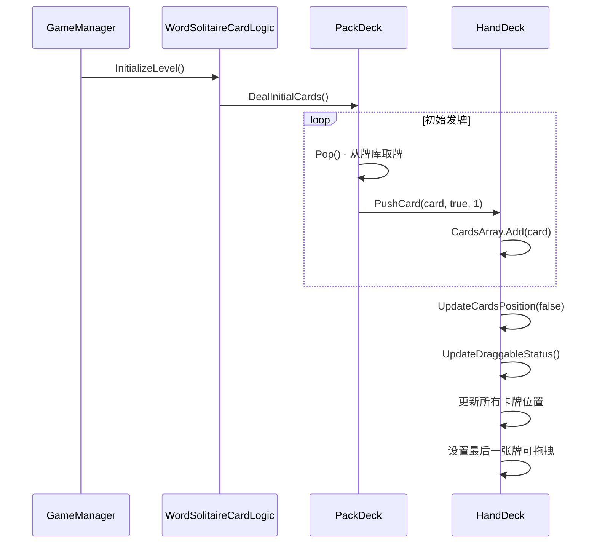
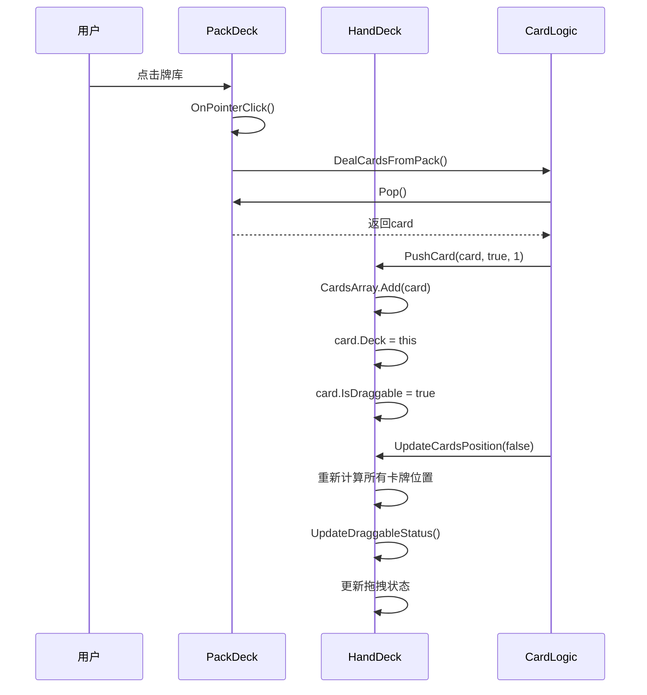
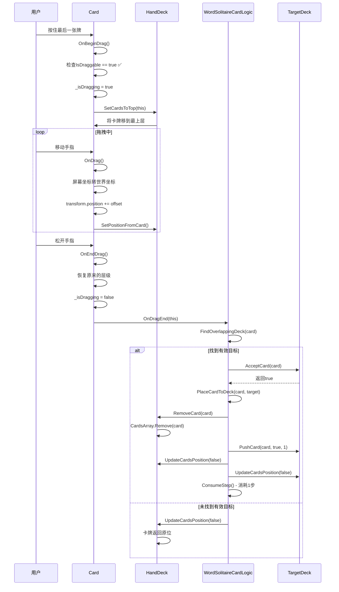
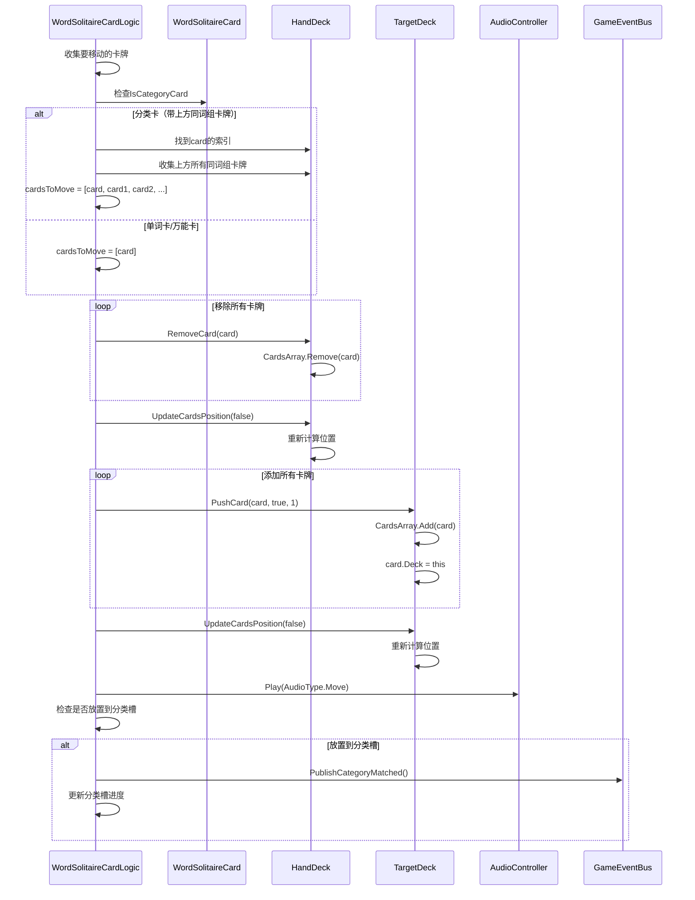
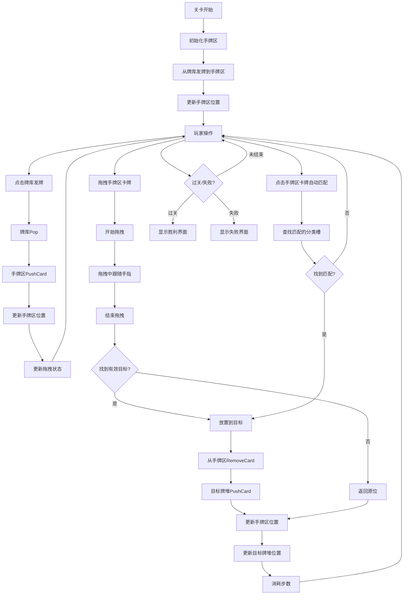

# 手牌区时序流程文档

## 文档版本

- **版本**: v1.0
- **创建日期**: 2026-03-23
- **作者**: AI Assistant
- **适用项目**: Word Solitaire (词语联想接龙)

---

## 目录

1. [手牌区概述](#1-手牌区概述)
2. [初始化流程](#2-初始化流程)
3. [接收卡牌流程](#3-接收卡牌流程)
4. [卡牌排列逻辑](#4-卡牌排列逻辑)
5. [拖拽取牌流程](#5-拖拽取牌流程)
6. [点击自动匹配流程](#6-点击自动匹配流程)
7. [放置卡牌流程](#7-放置卡牌流程)
8. [卡牌移除流程](#8-卡牌移除流程)
9. [UI显示逻辑](#9-ui显示逻辑)
10. [事件流程汇总](#10-事件流程汇总)
11. [产品规则对照](#11-产品规则对照)
12. [注意事项](#12-注意事项)
13. [相关文件](#13-相关文件)
14. [更新记录](#14-更新记录)

---

## 1. 手牌区概述

### 1.1 定义

手牌区（HandDeck）是Word Solitaire游戏中用于存放从牌库发出的卡牌的区域。玩家可以从手牌区拖拽卡牌到列区或分类槽，或点击卡牌自动匹配到对应的分类槽。

### 1.2 节点结构

**场景路径**: `Screen/Center/UpperSection/HandDeckGroup/HandCardsContainer`

```
HandDeckGroup (手牌堆区域)
    └── HandCardsContainer (手牌卡牌容器) ⭐ WordSolitaireDeck组件
        ├── 动态卡牌子节点
        └── ...
```

**组件挂载**:
- `WordSolitaireDeck` - 手牌区控制器
- `RectTransform` - 位置和大小配置
- `Image` - 背景图片（可选）

### 1.3 核心属性

```csharp
// WordSolitaireDeck.cs
public enum WordDeckType
{
    Pack,           // 牌库
    Hand,           // 手牌区
    Column,         // 列区
    CategorySlot    // 分类槽
}

public WordDeckType DeckType = WordDeckType.Hand;  // 手牌区类型
public HandCardDirection HandDirection = HandCardDirection.LeftToRight;  // 排列方向
public int MaxVisibleCards = 3;  // 最多显示3张卡牌
```

### 1.4 卡牌索引规则

**CardsArray结构**:
- 索引0: 最旧的卡牌（最早发到手牌区的）
- 索引CardsCount-1: 最新的卡牌（最后发到手牌区的）

**示例**（5张牌）:
```
CardsArray索引: [0] [1] [2] [3] [4]
                  ↓   ↓   ↓   ↓   ↓
              最旧 → 最新
```

---

## 2. 初始化流程

### 2.1 关卡初始化时序



### 2.2 初始化代码流程

```csharp
// WordSolitaireCardLogic.cs - InitializeLevel方法
public void InitializeLevel()
{
    // ... 其他初始化代码
    
    // 从牌库发初始卡牌到手牌区
    for (int i = 0; i < initialHandCardsCount; i++)
    {
        Card card = PackDeck.Pop();
        HandDeck.PushCard(card, true, 1);
    }
    
    // 更新手牌区位置
    HandDeck.UpdateCardsPosition(false);
    
    // 更新拖拽状态
    HandDeck.UpdateDraggableStatus();
}
```

### 2.3 初始化完成状态

**手牌区状态**:
- ✅ CardsArray包含初始卡牌（例如3-5张）
- ✅ 所有卡牌正面朝上
- ✅ 最后一张牌 IsDraggable = true
- ✅ 其他牌 IsDraggable = false
- ✅ 位置已按规则排列（最多显示3张）

---

## 3. 接收卡牌流程

### 3.1 从牌库发牌到时序



### 3.2 接收卡牌代码流程

```csharp
// Deck.cs - PushCard方法
public void PushCard(Card card, bool isDraggable = true, int cardStatus = 1)
{
    card.Deck = this;           // 设置卡牌所属牌堆
    card.IsDraggable = isDraggable;  // 设置可拖拽
    card.CardStatus = cardStatus;     // 设置卡牌状态
    CardsArray.Add(card);       // 添加到牌堆
}
```

### 3.3 接收卡牌后的状态更新

**自动调用的更新方法**:

1. **UpdateCardsPosition(false)**
   - 重新计算所有卡牌位置
   - 更新可见/隐藏状态
   - 调整卡牌层级

2. **UpdateDraggableStatus()**
   - 最后一张牌：IsDraggable = true
   - 其他牌：IsDraggable = false

---

## 4. 卡牌排列逻辑

### 4.1 排列方向

```csharp
public enum HandCardDirection
{
    LeftToRight,   // 正向排列（最新的在最左）
    RightToLeft    // 反向排列（最新的在最右）
}
```

### 4.2 可见卡牌计算

**计算逻辑**（正向排列）:

```csharp
// WordSolitaireDeck.cs - UpdateCardsPosition方法
int visibleCount = Mathf.Min(MaxVisibleCards, CardsCount);
int startIndex = CardsCount - visibleCount;  // 计算起始索引

// 例如：5张牌，最多显示3张
// visibleCount = 3
// startIndex = 5 - 3 = 2
// 显示索引2, 3, 4（最新的3张）
```

### 4.3 位置计算公式

**正向排列（LeftToRight）**:

```csharp
for (int i = 0; i < CardsCount; i++)
{
    WordSolitaireCard card = CardsArray[i] as WordSolitaireCard;
    
    if (i >= startIndex)  // 可见卡牌
    {
        int displayIndex = i - startIndex;  // 显示索引（0, 1, 2...）
        float xOffset = displayIndex * horizontalSpace;  // 水平偏移
        
        Vector3 newPosition = new Vector3(
            basePosition.x + xOffset,  // X轴偏移
            basePosition.y,
            basePosition.z
        );
        
        card.SetPosition(newPosition);
        card.SetCardFace(true);  // 正面朝上
    }
    else  // 隐藏卡牌
    {
        // 移到远处，显示卡背
        card.SetPosition(new Vector3(basePosition.x + 1000, basePosition.y, basePosition.z));
        card.SetCardFace(false);
    }
}
```

**关键参数**:
- `basePosition`: HandCardsContainer的位置
- `horizontalSpace`: 水平间距（40像素，使用`DECK_SPACE_HORIONTAL_WASTE`）
- `MaxVisibleCards`: 最大显示数量（默认3张）

### 4.4 排列示例

**场景1**: 2张牌（全部显示）

```
正向排列:     [0] [1]
              ↑   ↑
              可见 可见

反向排列:     [0] [1]
              ↑   ↑
              可见 可见（最新的在最右）
```

**场景2**: 5张牌（最多显示3张）

```
正向排列:     [隐藏] [隐藏] [2] [3] [4]
                              ↑   ↑   ↑
                              显示最新的3张（从左到右）

反向排列:     [隐藏] [隐藏] [2] [3] [4]
                              ↑   ↑   ↑
                              显示最新的3张（从左到右，最新的在最右）
```

**场景3**: 1张牌

```
正向排列:     [0]
              ↑
              可见（唯一的牌）

反向排列:     [0]
              ↑
              可见（唯一的牌）
```

### 4.5 视觉效果

**可见卡牌**:
- ✅ 水平排列，间距40像素
- ✅ 正面朝上（显示词语/分类）
- ✅ 层级递增（SetSiblingIndex）

**隐藏卡牌**:
- ✅ 位置：移到远处（X+1000）
- ✅ 朝向：卡背朝上
- ✅ 状态：从UI上完全消失

---

## 5. 拖拽取牌流程

### 5.1 拖拽取牌条件

**必须满足以下条件**:

1. **卡牌存在**: 手牌区至少有1张牌
2. **可拖拽状态**: 卡牌的 `IsDraggable = true`
3. **不处于特殊状态**:
   - 不处于自动完成模式
   - 不处于提示模式

**可拖拽卡牌判定**:

```csharp
// WordSolitaireDeck.cs - UpdateDraggableStatus方法
case WordDeckType.Hand:
    // 手牌区只有最后一张可拖动
    card.IsDraggable = (i == CardsCount - 1);
```

### 5.2 拖拽取牌完整时序



### 5.3 开始拖拽 - OnBeginDrag

```csharp
// Card.cs - OnBeginDrag方法
public void OnBeginDrag(PointerEventData eventData)
{
    // 检查是否允许拖拽
    if (CardLogicComponent.AutoCompleteComponent.IsAutoCompleteActive ||
        CardLogicComponent.HintManagerComponent.IsHintProcess ||
        !IsDraggable)
    {
        return;  // 不允许拖拽
    }

    _isDragging = true;

    // 计算卡牌在兄弟节点中的索引
    CalculateCardSiblingIndex();
    
    // 将卡牌移到最上层
    _deck.SetCardsToTop(this);
}
```

**关键操作**:
1. ✅ 检查 `IsDraggable` - 只有最后一张牌为true
2. ✅ 设置 `_isDragging = true` - 标记正在拖拽
3. ✅ 将卡牌移到最上层 - 确保拖拽时在最前面显示

### 5.4 拖拽中 - OnDrag

```csharp
// Card.cs - OnDrag方法
public void OnDrag(PointerEventData eventData)
{
    if (CardLogicComponent.AutoCompleteComponent.IsAutoCompleteActive || !IsDraggable)
    {
        return;
    }

    // 将屏幕坐标转换为世界坐标
    RectTransformUtility.ScreenPointToWorldPointInRectangle(
        CardRect, 
        Input.mousePosition,
        eventData.enterEventCamera, 
        out _newPosition
    );
    
    if (_lastMousePosition != Vector3.zero)
    {
        // 计算鼠标移动的偏移量
        Vector3 offset = _newPosition - _lastMousePosition;
        
        // 更新卡牌位置（跟随手指移动）
        transform.position += offset;
        
        // 更新原牌堆的位置（可能的连动效果）
        _deck.SetPositionFromCard(this, transform.position.x, transform.position.y);
    }

    _lastMousePosition = _newPosition;
}
```

**关键操作**:
1. ✅ 屏幕坐标转世界坐标
2. ✅ 跟随手指移动 - `transform.position += offset`
3. ✅ 实时更新位置 - 每次 `OnDrag` 调用都更新

### 5.5 结束拖拽 - OnEndDrag

```csharp
// Card.cs - OnEndDrag方法
public async void OnEndDrag(PointerEventData eventData)
{
    if (CardLogicComponent.AutoCompleteComponent.IsAutoCompleteActive || !IsDraggable)
    {
        return;
    }

    // 恢复原来的层级
    transform.SetSiblingIndex(IndexZ);
    _lastMousePosition = Vector3.zero;

    // 调用拖拽结束逻辑
    await CardLogicComponent.OnDragEnd(this);
    
    // 更新牌堆位置
    _deck.UpdateCardsPosition(false);

    _isDragging = false;
}
```

**关键操作**:
1. ✅ 恢复原来的层级 - `transform.SetSiblingIndex(IndexZ)`
2. ✅ 调用拖拽结束逻辑 - `CardLogicComponent.OnDragEnd(this)`

### 5.6 拖拽结束处理

```csharp
// WordSolitaireCardLogic.cs - OnDragEnd方法
public async Task OnDragEnd(WordSolitaireCard wordCard)
{
    // 查找重叠的牌堆
    WordSolitaireDeck targetDeck = FindOverlappingDeck(wordCard);
    
    if (targetDeck != null && targetDeck.AcceptCard(wordCard))
    {
        // 执行放置
        await PlaceCardToDeck(wordCard, targetDeck);
        
        // 消耗步数
        ConsumeStep();
    }
    else
    {
        // 返回原位
        ReturnCardToOriginalDeck(wordCard);
    }
}
```

### 5.7 查找重叠牌堆

```csharp
// WordSolitaireCardLogic.cs - FindOverlappingDeck方法
private WordSolitaireDeck FindOverlappingDeck(WordSolitaireCard card)
{
    WordSolitaireDeck bestDeck = null;
    float bestOverlap = 0f;
    
    // 检查所有牌堆
    CheckDeckOverlap(card, PackDeck as WordSolitaireDeck, ref bestDeck, ref bestOverlap);
    CheckDeckOverlap(card, HandDeck, ref bestDeck, ref bestOverlap);
    
    if (ColumnDecks != null)
    {
        foreach (var deck in ColumnDecks)
        {
            CheckDeckOverlap(card, deck, ref bestDeck, ref bestOverlap);
        }
    }
    
    if (CategorySlots != null)
    {
        foreach (var slot in CategorySlots)
        {
            CheckDeckOverlap(card, slot, ref bestDeck, ref bestOverlap);
        }
    }
    
    return bestDeck;
}
```

**检查范围**:
- ✅ 牌库（PackDeck）- 通常不接受
- ✅ 手牌区（HandDeck）- 拖回原位
- ✅ 列区（ColumnDecks）- 可以放置
- ✅ 分类槽（CategorySlots）- 可以放置

---

## 6. 点击自动匹配流程

### 6.1 点击自动匹配时序

```mermaid
sequenceDiagram
    participant User as 用户
    participant Card as WordSolitaireCard
    participant WSL as WordSolitaireCardLogic
    participant Slot as CategorySlot
    
    User->>Card: 点击手牌区最后一张牌
    Card->>Card: OnPointerClick()
    Card->>Card: 检查Deck.Type == DECK_TYPE_WASTE ✅
    Card->>Card: OnTapToPlace()
    Card->>WSL: TryAutoMatchCard(this)
    
    WSL->>WSL: 检查card.WordCardType != Joker ✅
    
    loop 遍历所有分类槽
        WSL->>Slot: 检查slot.CategoryId == card.CategoryId
        WSL->>Slot: 检查slot.AcceptCard(card)
        
        alt 找到匹配的分类槽
            WSL->>WSL: PlaceCardToDeck(card, slot)
            WSL->>HandDeck: RemoveCard(card)
            WSL->>Slot: PushCard(card, true, 1)
            WSL->>HandDeck: UpdateCardsPosition(false)
            WSL->>Slot: UpdateCardsPosition(false)
            WSL->>WSL: OnCardMatchedToCategorySlot()
            WSL->>WSL: PublishCategoryMatched() - 发布事件
            break 退出循环
        end
    end
```

### 6.2 点击事件处理

```csharp
// Card.cs - OnPointerClick方法
public void OnPointerClick(PointerEventData eventData)
{
    switch (Deck.Type)
    {
        case DeckType.DECK_TYPE_PACK:
            OnTapToPack(eventData);  // 点击牌库：发牌
            break;
            
        case DeckType.DECK_TYPE_BOTTOM:      // 列区
        case DeckType.DECK_TYPE_WASTE:       // 手牌区
        case DeckType.DECK_TYPE_ACE:         // 分类槽
        case DeckType.DECK_TYPE_FREECELL:
        case DeckType.DECK_TYPE_TRIPEAKS:
        case DeckType.DECK_TYPE_PYRAMID:
            OnTapToPlace();  // 点击手牌区：尝试自动匹配
            break;
    }
}
```

### 6.3 自动匹配逻辑

```csharp
// WordSolitaireCardLogic.cs - TryAutoMatchCard方法
public void TryAutoMatchCard(WordSolitaireCard card)
{
    // 万能卡不自动匹配
    if (card.WordCardType == CardType.Joker) return;
    
    // 查找对应的分类槽
    if (CategorySlots != null)
    {
        foreach (var slot in CategorySlots)
        {
            // 检查CategoryId是否匹配
            if (slot.CategoryId == card.CategoryId && slot.AcceptCard(card))
            {
                // 找到匹配，放置卡牌
                PlaceCardToDeck(card, slot);
                return;
            }
        }
    }
}
```

**自动匹配规则**:
- ✅ 只对非万能卡有效
- ✅ 查找相同CategoryId的分类槽
- ✅ 检查分类槽是否接受该卡牌
- ✅ 如果匹配成功，直接放置到分类槽

### 6.4 自动匹配的限制

**与拖拽的区别**:

| 特性 | 拖拽 | 点击自动匹配 |
|------|------|-------------|
| 目标位置 | 任意有效位置（列区、分类槽） | 仅分类槽 |
| 灵活性 | 高 | 低 |
| 操作方式 | 按住拖动 | 单击 |
| 步数消耗 | 消耗1步 | 消耗1步 |
| 手牌区操作 | ✅ 可以拖到列区 | ❌ 不能自动匹配到列区 |

---

## 7. 放置卡牌流程

### 7.1 放置卡牌时序



### 7.2 放置卡牌代码流程

```csharp
// WordSolitaireCardLogic.cs - PlaceCardToDeck方法
private async Task PlaceCardToDeck(WordSolitaireCard card, WordSolitaireDeck targetDeck)
{
    WordSolitaireDeck originalDeck = card.Deck as WordSolitaireDeck;
    
    // 收集要移动的卡牌
    List<WordSolitaireCard> cardsToMove = new List<WordSolitaireCard>();
    cardsToMove.Add(card);
    
    // 如果是分类卡，收集上方的同词组卡牌
    if (card.IsCategoryCard && originalDeck != null)
    {
        int cardIndex = originalDeck.CardsArray.IndexOf(card);
        if (cardIndex >= 0 && cardIndex < originalDeck.CardsArray.Count - 1)
        {
            for (int i = cardIndex + 1; i < originalDeck.CardsArray.Count; i++)
            {
                WordSolitaireCard aboveCard = originalDeck.CardsArray[i] as WordSolitaireCard;
                if (aboveCard != null && aboveCard.CategoryId == card.CategoryId)
                {
                    cardsToMove.Add(aboveCard);
                }
                else
                {
                    break;
                }
            }
        }
    }
    
    // 从原牌堆移除所有卡牌
    if (originalDeck != null)
    {
        foreach (var c in cardsToMove)
        {
            originalDeck.RemoveCard(c);
        }
        originalDeck.UpdateCardsPosition(false);
    }
    
    // 添加到目标牌堆
    foreach (var c in cardsToMove)
    {
        targetDeck.PushCard(c, true, 1);
    }
    targetDeck.UpdateCardsPosition(false);
    
    // 播放音效
    if (AudioCtrl != null)
    {
        AudioCtrl.Play(AudioController.AudioType.Move);
    }
    
    // 检查匹配（只检查主卡）
    if (targetDeck.DeckType == WordDeckType.CategorySlot)
    {
        OnCardMatchedToCategorySlot(card, targetDeck);
    }
    
    await Task.Yield();
}
```

### 7.3 分类卡连带移动

**规则**:
- ✅ 分类卡拖拽时，会携带上方的同词组卡牌
- ✅ 只收集连续的同词组卡牌
- ✅ 遇到不同词组卡牌时停止收集

**示例**:
```
列区卡牌:
[分类卡A] [单词卡A1] [单词卡A2] [分类卡B] [单词卡B1]
           ↑         ↑         ↑         ↑         ↑
           同词组A              不同词组
           
拖拽分类卡A:
→ 收集: [分类卡A, 单词卡A1, 单词卡A2]
→ 不收集: [分类卡B, 单词卡B1]（不同词组）
```

---

## 8. 卡牌移除流程

### 8.1 从手牌区移除卡牌

```csharp
// Deck.cs - RemoveCard方法
public void RemoveCard(Card card)
{
    if (CardsArray.Contains(card))
    {
        CardsArray.Remove(card);
        card.Deck = null;
    }
}
```

### 8.2 移除后的状态更新

**自动调用的更新方法**:

1. **UpdateCardsPosition(false)**
   - 重新计算所有剩余卡牌位置
   - 更新可见/隐藏状态
   - 可能显示新的卡牌（之前隐藏的）

2. **UpdateDraggableStatus()**
   - 新的最后一张牌：IsDraggable = true
   - 其他牌：IsDraggable = false

### 8.3 移除示例

**场景**: 手牌区有5张牌，移除最后一张

```
移除前:
CardsArray: [0] [1] [2] [3] [4]
可见状态:    隐藏  隐藏  可见  可见  可见
可拖拽:      ❌   ❌   ❌   ❌   ✅

移除后:
CardsArray: [0] [1] [2] [3]
可见状态:    隐藏  可见  可见  可见
可拖拽:      ❌   ❌   ❌   ✅

效果: 索引2从隐藏变为可见
```

---

## 9. UI显示逻辑

### 9.1 卡牌状态切换

**手牌区卡牌状态表**:

| 卡牌索引 | 是否最新 | 可见状态 | IsDraggable | 显示面 |
|---------|---------|---------|-------------|--------|
| 最后一张 | ✅ | 可见（MaxVisibleCards内） | ✅ true | 正面 |
| 倒数第二张 | ❌ | 可见（MaxVisibleCards内） | ❌ false | 正面 |
| ... | ❌ | 可见（MaxVisibleCards内） | ❌ false | 正面 |
| 旧卡牌 | ❌ | 隐藏（超出MaxVisibleCards） | ❌ false | 卡背 |

### 9.2 MaxVisibleCards=3 的显示规则

**5张牌时的显示状态**:

| CardsCount | 可见数量 | startIndex | 显示索引 | 隐藏索引 |
|-----------|---------|-----------|---------|---------|
| 5 | 3 | 2 | 2, 3, 4 | 0, 1 |
| 4 | 3 | 1 | 1, 2, 3 | 0 |
| 3 | 3 | 0 | 0, 1, 2 | - |
| 2 | 2 | 0 | 0, 1 | - |
| 1 | 1 | 0 | 0 | - |

### 9.3 排列方向的影响

**正向排列（LeftToRight）**:
- 显示顺序: [最新-3], [最新-2], [最新-1]
- 最新牌在最左边

**反向排列（RightToLeft）**:
- 显示顺序: [最新-3], [最新-2], [最新-1]
- 最新牌在最右边

**注意**: 两种方向的卡牌排列顺序相同，但最新的牌在排列方向的尽头。

---

## 10. 事件流程汇总

### 10.1 完整游戏流程



### 10.2 关键决策点

**决策点1: 拖拽到哪个牌堆**

```
拖拽结束
    ↓
查找重叠牌堆（FindOverlappingDeck）
    ↓
检查牌堆优先级:
    1. 分类槽 - 如果重叠面积最大
    2. 列区 - 如果重叠面积最大
    3. 手牌区 - 拖回原位
    4. 牌库 - 通常不接受
    ↓
检查AcceptCard()是否返回true
    ↓
决定是否放置
```

**决策点2: 点击自动匹配到哪个分类槽**

```
点击卡牌
    ↓
遍历所有分类槽
    ↓
检查CategoryId是否匹配
    ↓
检查AcceptCard()是否返回true
    ↓
找到第一个匹配的分类槽
    ↓
直接放置，停止遍历
```

**决策点3: 分类卡是否携带上方卡牌**

```
拖拽分类卡
    ↓
检查card.IsCategoryCard == true
    ↓
检查上方是否有卡牌
    ↓
检查上方卡牌的CategoryId是否相同
    ↓
收集所有连续的同词组卡牌
    ↓
一起移动
```

---

## 11. 产品规则对照

### 11.1 操作消耗规则对照

| 产品规则 | 代码实现 | 对照状态 |
|---------|---------|---------|
| 点击牌库发牌消耗1步 | `ConsumeStep()` 在发牌后调用 | ✅ 符合 |
| 拖拽到分类槽消耗1步 | `ConsumeStep()` 在放置成功后调用 | ✅ 符合 |
| 拖拽到列区消耗1步 | `ConsumeStep()` 在放置成功后调用 | ✅ 符合 |
| 列间移动消耗1步 | `ConsumeStep()` 在放置成功后调用 | ✅ 符合 |
| 点击自动匹配消耗1步 | `ConsumeStep()` 在自动匹配后调用 | ✅ 符合 |

### 11.2 手牌区操作规则对照

| 产品规则（第197-216行） | 代码实现 | 对照状态 |
|----------------------|---------|---------|
| 只有最新的一张手牌允许拖拽 | `card.IsDraggable = (i == CardsCount - 1)` | ✅ 符合 |
| 手牌区每次只拖拽1张 | 只检查单张卡的 `IsDraggable` | ✅ 符合 |
| 最多显示3张，超过3张时将之前的卡牌隐藏 | `MaxVisibleCards = 3`，隐藏逻辑在 `UpdateCardsPosition` | ✅ 符合 |

### 11.3 分类卡连带移动规则

| 产品规则 | 代码实现 | 对照状态 |
|---------|---------|---------|
| 分类卡拖拽时携带上方同词组卡牌 | `PlaceCardToDeck` 中收集同词组卡牌 | ✅ 符合 |
| 只收集连续的同词组卡牌 | 遇到不同CategoryId时break | ✅ 符合 |
| 遇到不同词组停止收集 | 遇到不同CategoryId时break | ✅ 符合 |

---

## 12. 注意事项

### 12.1 开发注意事项

1. **只拖拽最后一张牌**
   - 确保只设置最后一张牌的 `IsDraggable = true`
   - 检查 `UpdateDraggableStatus()` 方法实现

2. **最多显示3张卡牌**
   - `MaxVisibleCards` 参数默认为3
   - 超出的卡牌需要隐藏（移到远处）

3. **水平间距配置**
   - 使用 `DECK_SPACE_HORIONTAL_WASTE` 配置间距（40像素）
   - 可能需要根据实际卡牌大小调整

4. **排列方向**
   - 默认 `LeftToRight`（正向排列）
   - 可以通过 `HandDirection` 参数修改

5. **点击与拖拽的区别**
   - 点击：只自动匹配到分类槽
   - 拖拽：可以放置到任意有效位置（列区、分类槽）

### 12.2 测试检查点

1. **初始化测试**
   - [ ] 手牌区初始卡牌数量正确
   - [ ] 所有卡牌正面朝上
   - [ ] 最后一张牌可拖拽，其他不可拖拽

2. **发牌测试**
   - [ ] 从牌库发牌到手牌区
   - [ ] 新牌自动更新可见状态
   - [ ] 新牌设置为可拖拽
   - [ ] 旧牌自动隐藏（如果超过3张）

3. **拖拽测试**
   - [ ] 只能拖拽最后一张牌
   - [ ] 拖拽中卡牌跟随手指
   - [ ] 可以拖到列区
   - [ ] 可以拖到分类槽
   - [ ] 无效位置自动返回原位

4. **点击测试**
   - [ ] 点击最后一张牌自动匹配到分类槽
   - [ ] 点击其他牌无效果
   - [ ] 万能卡点击不自动匹配

5. **UI显示测试**
   - [ ] 最多显示3张卡牌
   - [ ] 超出数量时旧牌隐藏
   - [ ] 隐藏的牌显示卡背
   - [ ] 正向/反向排列正确

### 12.3 潜在问题

1. **性能问题**
   - 隐藏的卡牌移到1000像素外，可能不是最优方案
   - 建议考虑使用 `SetActive(false)` 替代

2. **排列方向**
   - 默认 `LeftToRight` 可能不符合用户习惯
   - 需要根据实际UI布局测试

3. **水平间距**
   - 硬编码的40像素可能需要根据卡牌大小调整
   - 建议配置为可调参数

4. **点击区域**
   - 点击手牌区容器无效果
   - 用户可能期望点击容器也能操作

---

## 13. 相关文件

### 13.1 核心文件

| 文件路径 | 说明 | 关键方法 |
|---------|------|---------|
| `Assets/SimpleSolitaire/Resources/Scripts/Controller/WordSolitaire/WordSolitaireDeck.cs` | 手牌区控制器 | `UpdateCardsPosition()`, `UpdateDraggableStatus()` |
| `Assets/SimpleSolitaire/Resources/Scripts/Controller/WordSolitaire/WordSolitaireCard.cs` | Word Solitaire卡牌 | `OnTapToPlace()` |
| `Assets/SimpleSolitaire/Resources/Scripts/Controller/WordSolitaire/WordSolitaireCardLogic.cs` | 游戏逻辑控制器 | `OnDragEnd()`, `TryAutoMatchCard()`, `PlaceCardToDeck()` |
| `Assets/SimpleSolitaire/Resources/Scripts/Controller/Base/Card.cs` | 卡牌基类 | `OnBeginDrag()`, `OnDrag()`, `OnEndDrag()`, `OnPointerClick()` |
| `Assets/SimpleSolitaire/Resources/Scripts/Controller/Base/Deck.cs` | 牌堆基类 | `PushCard()`, `Pop()`, `RemoveCard()` |

### 13.2 相关文档

| 文档路径 | 说明 |
|---------|------|
| `Documents/牌库时序流程文档.md` | 牌库的完整时序流程 |
| `Documents/WordSolitaire 场景节点说明.md` | 场景节点结构和配置 |
| `Documents/词语联想接龙-产品功能文档.md` | 产品功能规则 |

### 13.3 规则文件

| 文件路径 | 说明 |
|---------|------|
| `.codebuddy/rules/wordsolitaire-node-structure-reference.mdc` | 节点结构查询规范 |
| `.codebuddy/rules/wordsolitaire-gameplay-rules.mdc` | 玩法规则规范 |
| `.codebuddy/rules/unity-code-change-validation.mdc` | 代码变更验证流程 |

---

## 14. 更新记录

### v1.0 (2026-03-23)

**初始版本创建**

**内容**:
- 完整的手牌区时序流程文档
- 包含14个主要章节
- 详细的代码引用和时序图
- 与产品规则的对照
- 开发和测试检查点

**特色**:
- ✅ 时序图清晰展示操作步骤
- ✅ 代码引用关键代码段
- ✅ 状态表UI元素切换对照
- ✅ 规则对照产品文档验证
- ✅ 测试检查点关键验证

**覆盖流程**:
- ✅ 初始化流程
- ✅ 接收卡牌流程
- ✅ 卡牌排列逻辑
- ✅ 拖拽取牌流程
- ✅ 点击自动匹配流程
- ✅ 放置卡牌流程
- ✅ 卡牌移除流程
- ✅ UI显示逻辑

---

**文档结束**

本文档详细描述了Word Solitaire手牌区的所有时序流程，包括初始化、发牌、拖拽、点击自动匹配、放置卡牌等操作。可作为开发和测试的参考指南。
